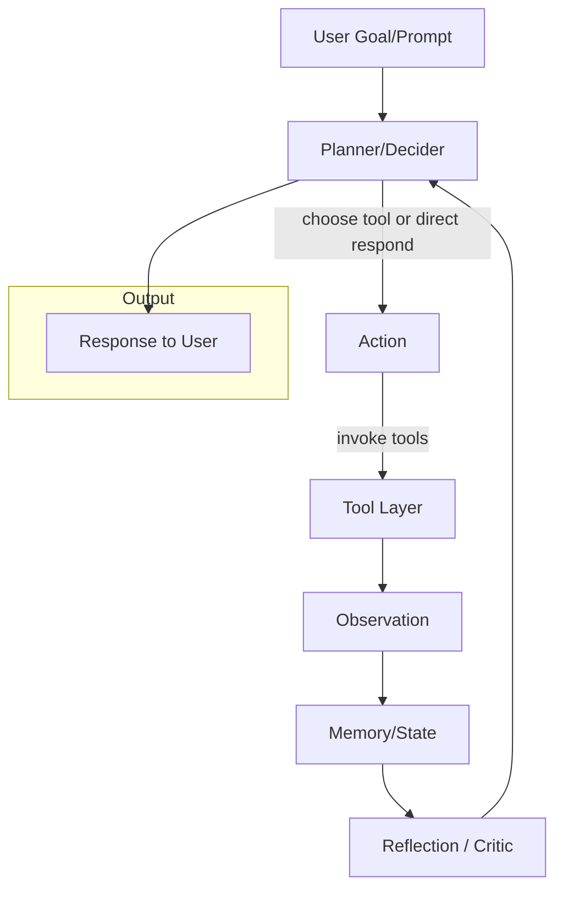

# OpenManus-Go

🤖 **OpenManus-Go** 是一个通用的 AI Agent 框架，基于 Go 语言实现，强调简单可用、易扩展和开放工具生态。

## ✨ 特性

- 🎯 **目标驱动**：通过自然语言描述目标，Agent 自动规划和执行
- 🔄 **智能循环**：Plan → Tool Use → Observation → Reflection → Next Action
- 🛠️ **丰富工具**：内置 HTTP、文件系统、数据库、浏览器、爬虫等工具
- 🔌 **MCP 兼容**：支持 Model Context Protocol 标准
- 📊 **数据分析**：专门的数据分析 Agent 支持
- 🚀 **高性能**：Go 语言实现，支持并发和高效执行
- 🐳 **容器化**：完整的 Docker 部署方案

## 🏗️ 架构概览



## 🚀 快速开始

### 1. 安装

```bash
# 克隆仓库
git clone https://github.com/openmanus/openmanus-go.git
cd openmanus-go

# 下载依赖
go mod download
```

### 2. 配置

```bash
# 创建配置文件
cp configs/config.example.toml config.toml

# 编辑配置文件，设置 API Key
# api_key = "your-openai-api-key-here"
```

### 3. 构建和运行

```bash
# 构建
make build

# 运行交互模式
./bin/openmanus run --interactive

# 或者直接执行任务
./bin/openmanus run "创建一个 hello.txt 文件，内容为 Hello World"
```

## 📋 命令行使用

### 基本命令

```bash
# 交互模式
openmanus run --interactive

# 执行单个任务
openmanus run "你的任务描述"

# 查看可用工具
openmanus tools list

# 测试工具连接
openmanus tools test

# 显示配置
openmanus config show

# 初始化配置文件
openmanus config init
```

### 高级功能

```bash
# 启动 MCP 服务器
openmanus mcp --port 8080

# 多 Agent 流程（实验性）
openmanus flow --data-analysis

# 限制执行参数
openmanus run "任务" --max-steps 5 --max-tokens 2000
```

## 🛠️ 内置工具

| 工具 | 描述 | 功能 |
|------|------|------|
| **HTTP** | HTTP 请求工具 | GET、POST、PUT、DELETE 请求 |
| **FileSystem** | 文件系统工具 | 读写文件、目录操作 |
| **Redis** | Redis 数据库工具 | 字符串、哈希、列表、集合操作 |
| **MySQL** | MySQL 数据库工具 | 查询、插入、更新、删除 |
| **Browser** | 浏览器自动化工具 | 页面导航、元素操作、截图 |
| **Crawler** | 网页爬虫工具 | 内容抓取、链接提取 |

## 📊 使用示例

### 单 Agent 任务

```go
// 创建 Agent
agent := agent.NewBaseAgent(llmClient, toolRegistry, config)

// 执行任务
result, err := agent.Loop(ctx, "分析 data.csv 文件并生成报告")
```

### 数据分析任务

```bash
# 启用数据分析 Agent
openmanus run --data-analysis "分析销售数据并生成可视化图表"
```

### 多步骤任务

```bash
openmanus run "搜索最新的 Go 语言新闻，总结前5条，并保存到文件"
```

## 🐳 Docker 部署

### 快速启动

```bash
# 设置环境变量
export OPENMANUS_LLM_API_KEY="your-api-key"

# 启动基础服务
docker-compose up -d

# 启动完整服务（包括 ES、MinIO）
docker-compose --profile full up -d

# 启动监控服务
docker-compose --profile monitoring up -d
```

### 服务说明

- **openmanus**: 主应用 (端口 8080)
- **redis**: 缓存和状态存储 (端口 6379)
- **mysql**: 关系数据库 (端口 3306)
- **elasticsearch**: 搜索引擎 (端口 9200, 可选)
- **minio**: 对象存储 (端口 9000/9001, 可选)
- **grafana**: 监控面板 (端口 3000, 可选)

## 🔧 配置说明

### LLM 配置

```toml
[llm]
model = "gpt-3.5-turbo"
base_url = "https://api.openai.com/v1"
api_key = "your-api-key-here"
temperature = 0.1
max_tokens = 4000
```

### Agent 配置

```toml
[agent]
max_steps = 10
max_tokens = 8000
max_duration = "5m"
reflection_steps = 3
max_retries = 2
```

### 工具配置

```toml
[tools.filesystem]
allowed_paths = ["./workspace", "./data"]
blocked_paths = ["/etc", "/sys", "/proc"]

[tools.http]
timeout = 30
blocked_domains = ["localhost", "127.0.0.1"]
```

## 🎯 应用场景

### 数据处理
- CSV/Excel 文件分析
- 数据清洗和转换
- 统计分析和可视化
- 报告自动生成

### 网络任务
- 网页内容抓取
- API 数据获取
- 批量下载处理
- 内容聚合分析

### 文件操作
- 批量文件处理
- 文档格式转换
- 目录结构整理
- 文件内容搜索

### 系统管理
- 配置文件管理
- 日志分析处理
- 系统状态检查
- 自动化运维任务

## 🏗️ 开发指南

### 项目结构

```
openmanus-go/
├── cmd/                    # CLI 入口
├── pkg/                    # 核心库
│   ├── agent/              # Agent 实现
│   ├── tool/               # 工具系统
│   ├── llm/                # LLM 抽象
│   ├── config/             # 配置管理
│   └── state/              # 状态管理
├── internal/               # 内部模块
├── examples/               # 使用示例
├── deployments/            # 部署配置
└── docs/                   # 文档
```

### 自定义工具

```go
// 实现 Tool 接口
type MyTool struct {
    *tool.BaseTool
}

func (t *MyTool) Invoke(ctx context.Context, args map[string]any) (map[string]any, error) {
    // 工具逻辑实现
    return result, nil
}

// 注册工具
tool.Register(myTool)
```

### 扩展 Agent

```go
// 创建自定义 Agent
type MyAgent struct {
    *agent.BaseAgent
}

func (a *MyAgent) Plan(ctx context.Context, goal string, trace *state.Trace) (state.Action, error) {
    // 自定义规划逻辑
    return action, nil
}
```

## 📚 文档

- [架构设计](docs/ARCHITECTURE.md)
- [工具开发](docs/TOOLS.md)
- [提示词工程](docs/PROMPTS.md)
- [部署指南](docs/DEPLOYMENT.md)
- [API 参考](docs/API.md)

## 🤝 贡献

我们欢迎各种形式的贡献！

1. Fork 项目
2. 创建特性分支 (`git checkout -b feature/AmazingFeature`)
3. 提交更改 (`git commit -m 'Add some AmazingFeature'`)
4. 推送到分支 (`git push origin feature/AmazingFeature`)
5. 打开 Pull Request

## 📄 许可证

本项目采用 MIT 许可证 - 查看 [LICENSE](LICENSE) 文件了解详情。

## 🙏 致谢

- 感谢 [OpenManus](https://github.com/openmanus/openmanus) 原项目的启发
- 感谢所有贡献者和社区支持

## 📞 联系我们

- GitHub Issues: [提交问题](https://github.com/openmanus/openmanus-go/issues)
- 讨论区: [GitHub Discussions](https://github.com/openmanus/openmanus-go/discussions)

---

**OpenManus-Go** - 让 AI Agent 更简单、更强大！ 🚀
