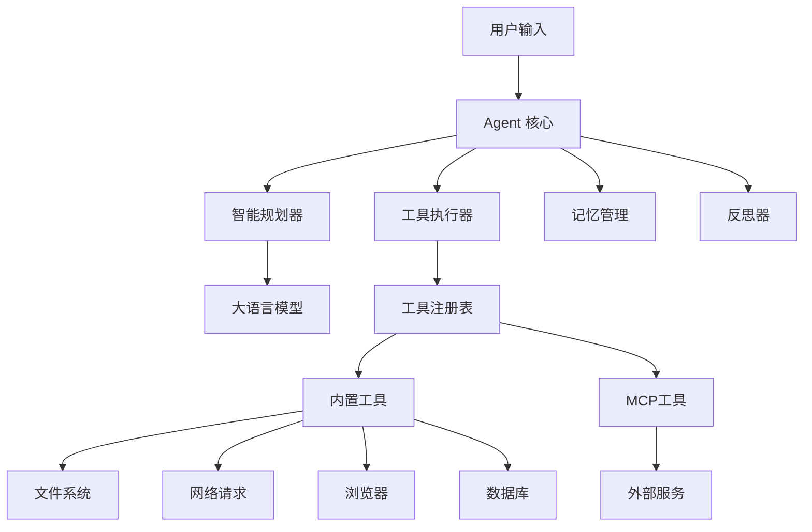

# OpenManus-Go

🤖 **OpenManus-Go** 是一个基于 Go 语言开发的通用 AI Agent 框架，采用 Plan → Tool Use → Observation → Reflection 循环模式，帮助用户通过自然语言指令完成复杂任务。

## ✨ 核心特性

### 🎯 智能 Agent 架构
- **自动规划**：将复杂目标分解为可执行的步骤
- **工具调用**：智能选择并执行适合的工具
- **实时观测**：监控每步执行结果并调整策略
- **反思机制**：定期评估进度并优化执行路径

### 🔌 MCP (Model Context Protocol) 集成
- **MCP 服务器**：提供标准化的工具接口
- **MCP 客户端**：连接和调用外部 MCP 服务
- **自动发现**：动态发现可用的 MCP 工具
- **统一管理**：将 MCP 工具与内置工具统一管理

### 🛠️ 丰富的内置工具生态
- **文件系统**：文件读写、目录操作、权限管理
- **网络请求**：HTTP 客户端、网页爬虫
- **浏览器自动化**：页面操作、截图、数据提取
- **数据库操作**：Redis、MySQL 数据操作
- **可扩展架构**：易于添加自定义工具

### 🚀 企业级特性
- **配置管理**：支持 TOML 配置文件和环境变量
- **日志系统**：结构化日志，支持多种输出格式
- **状态追踪**：持久化执行轨迹，支持断点续传
- **容器化部署**：完整的 Docker 支持

## 🏗️ 系统架构



## 🚀 快速开始

### 环境要求

- Go 1.21+
- (可选) Docker 用于容器化部署
- (可选) Redis 用于状态存储
- (可选) Chrome/Chromium 用于浏览器自动化

### 安装和构建

```bash
# 1. 克隆项目
git clone https://github.com/your-org/openmanus-go.git
cd openmanus-go

# 2. 安装依赖
go mod download

# 3. 构建项目
make build

# 或者直接使用 go build
go build -o bin/openmanus cmd/openmanus/main.go
```

### 配置设置

```bash
# 1. 复制配置模板
cp configs/config.example.toml configs/config.toml

# 2. 编辑配置文件（设置 LLM API Key）
vim configs/config.toml
```

最小配置示例：
```toml
[llm]
model = "deepseek-chat"
base_url = "https://api.deepseek.com/v1"
api_key = "your-api-key-here"
temperature = 0.1
max_tokens = 4000

[agent]
max_steps = 15
max_duration = "10m"
reflection_steps = 3
```

### 基本使用

```bash
# 1. 交互模式
./bin/openmanus run --config configs/config.toml --interactive

# 2. 单次任务执行
./bin/openmanus run --config configs/config.toml "创建一个hello.txt文件，内容为当前时间"

# 3. 查看可用工具
./bin/openmanus tools list --config configs/config.toml

# 4. 配置验证
./bin/openmanus config validate --config configs/config.toml
```

## 📋 使用示例

### 文件操作任务
```bash
# 文件创建和管理
./bin/openmanus run "在workspace目录创建一个report.txt文件，写入今天的日期和时间"

# 目录操作
./bin/openmanus run "检查workspace目录下有哪些文件，并创建一个文件清单"
```

### 网络数据获取
```bash
# HTTP 请求
./bin/openmanus run "获取https://httpbin.org/json的内容并保存到data.json文件"

# 网页爬虫
./bin/openmanus run "爬取某个网站的标题和描述信息"
```

### 数据处理任务
```bash
# 数据分析
./bin/openmanus run "分析workspace/sales.csv文件，生成月度销售报告"

# 格式转换
./bin/openmanus run "将JSON文件转换为CSV格式"
```

### MCP 集成示例
```bash
# 使用外部 MCP 服务
./bin/openmanus run "使用股票查询工具获取苹果公司的实时股价"

# 复合任务
./bin/openmanus run "查询比特币价格，如果超过50000美元，发送通知邮件"
```

## 🛠️ 内置工具

| 工具名称 | 功能描述 | 主要用途 |
|---------|----------|----------|
| `fs` | 文件系统操作 | 文件读写、目录管理、权限控制 |
| `http` | HTTP 客户端 | API 调用、数据获取、网络请求 |
| `crawler` | 网页爬虫 | 网页内容抓取、数据收集 |
| `browser` | 浏览器自动化 | 页面操作、截图、表单填写 |
| `redis` | Redis 数据库 | 缓存操作、数据存储 |
| `mysql` | MySQL 数据库 | 关系型数据操作 |

### 工具安全特性

- **路径限制**：文件系统工具支持路径白名单和黑名单
- **域名过滤**：HTTP 工具支持域名访问控制
- **超时控制**：所有网络操作都有超时保护
- **资源限制**：支持文件大小、内存使用限制

## 🔌 MCP (Model Context Protocol) 支持

### MCP 服务器配置

在 `configs/config.toml` 中添加 MCP 服务器：

```toml
[[mcp_servers]]
name = "stock-helper"
transport = "sse"
url = "https://api.example.com/mcp/stock"
timeout = 30

[[mcp_servers]]
name = "weather-service"
transport = "http"
url = "https://weather.example.com/mcp"
```

### MCP 工具发现

启动时自动发现 MCP 工具：
```
🔍 正在发现 MCP 工具...
  ✅ stock-price (股价查询)
  ✅ weather-forecast (天气预报)  
  ✅ news-search (新闻搜索)
📊 共发现 3 个 MCP 工具
```

### MCP 工具使用

Agent 会自动选择最适合的 MCP 工具：
```bash
./bin/openmanus run "查询特斯拉今日股价并分析趋势"
# Agent 自动使用 stock-price 工具获取数据
```

## 🐳 Docker 部署

### 快速启动

```bash
# 1. 设置环境变量
export OPENMANUS_LLM_API_KEY="your-api-key"
export OPENMANUS_LLM_MODEL="deepseek-chat"

# 2. 启动服务
docker-compose up -d

# 3. 检查服务状态
docker-compose ps
```

### 完整部署（包含监控）

```bash
# 启动完整服务栈
docker-compose --profile full up -d

# 访问服务
# - OpenManus: http://localhost:8080
# - Grafana: http://localhost:3000
# - Redis: localhost:6379
```

### 容器服务说明

- **openmanus**: 主应用服务
- **redis**: 状态存储和缓存
- **mysql**: 持久化数据存储（可选）
- **grafana**: 监控面板（可选）
- **prometheus**: 指标收集（可选）

## ⚙️ 配置详解

### LLM 配置

```toml
[llm]
model = "deepseek-chat"                    # 支持 OpenAI 兼容模型
base_url = "https://api.deepseek.com/v1"   # API 端点
api_key = "sk-xxx"                         # API 密钥
temperature = 0.1                          # 生成温度 (0.0-1.0)
max_tokens = 4000                          # 单次最大 token 数
timeout = 60                               # 请求超时（秒）
```

### Agent 配置

```toml
[agent]
max_steps = 15                             # 最大执行步数
max_tokens = 10000                         # token 预算限制
max_duration = "10m"                       # 最大执行时间
reflection_steps = 3                       # 反思步数间隔
max_retries = 3                            # 失败重试次数
```

### 工具配置

```toml
[tools.filesystem]
allowed_paths = ["./workspace", "./data"]  # 允许访问路径
blocked_paths = ["/etc", "/sys"]           # 禁止访问路径
max_file_size = "100MB"                    # 最大文件大小

[tools.http]
timeout = 45                               # 请求超时
blocked_domains = ["localhost"]            # 禁止访问域名
user_agent = "OpenManus-Go/1.0"           # 用户代理

[tools.browser]
headless = true                            # 无头模式
timeout = 60                               # 页面超时
chrome_args = ["--no-sandbox"]            # Chrome 参数
```

## 🏗️ 开发指南

### 项目结构

```
openmanus-go/
├── cmd/openmanus/          # CLI 应用入口
├── pkg/                    # 核心库
│   ├── agent/             # Agent 实现
│   ├── tool/              # 工具系统
│   ├── llm/               # LLM 客户端
│   ├── config/            # 配置管理
│   ├── state/             # 状态管理
│   └── mcp/               # MCP 协议
├── examples/              # 使用示例
├── configs/               # 配置文件
├── deployments/           # 部署配置
└── docs/                  # 文档
```

### 创建自定义工具

```go
package main

import (
    "context"
    "openmanus-go/pkg/tool"
)

// 实现 Tool 接口
type CustomTool struct {
    *tool.BaseTool
}

func (t *CustomTool) Invoke(ctx context.Context, args map[string]any) (map[string]any, error) {
    // 实现工具逻辑
    input := args["input"].(string)
    
    return map[string]any{
        "success": true,
        "result":  "处理结果: " + input,
    }, nil
}

// 注册工具
func init() {
    schema := tool.CreateJSONSchema("object", map[string]any{
        "input": tool.StringProperty("输入参数"),
    }, []string{"input"})
    
    baseTool := tool.NewBaseTool(
        "custom-tool",
        "自定义工具示例",
        schema,
        schema,
    )
    
    customTool := &CustomTool{BaseTool: baseTool}
    tool.Register(customTool)
}
```

### 扩展 MCP 集成

```go
// 添加新的 MCP 服务器
mcpConfig := &config.MCPServerConfig{
    Name:      "my-service",
    Transport: "sse",
    URL:       "https://my-mcp-server.com/api",
    Timeout:   30,
}

// 注册到配置
config.AddMCPServer(mcpConfig)
```

## 📊 监控和日志

### 日志配置

```toml
[logging]
level = "info"                              # debug|info|warn|error
output = "console"                          # console|file|both  
format = "json"                             # text|json
file_path = "./logs/openmanus.log"          # 日志文件路径
```

### 性能监控

```toml
[monitoring]
enabled = true                              # 启用监控
metrics_port = 9090                         # 指标端口
prometheus_path = "/metrics"                # Prometheus 路径
```

### 执行轨迹

每次执行都会生成详细的轨迹记录：
```bash
# 查看执行轨迹
ls ./workspace/traces/

# 轨迹包含的信息：
# - 执行步骤和时间
# - 工具调用和结果  
# - 错误和重试记录
# - 性能指标
```

## 🧪 测试和验证

### 运行测试

```bash
# 运行所有测试
make test

# 运行特定模块测试
go test ./pkg/agent/...

# 集成测试
make test-integration
```

### 工具测试

```bash
# 测试所有工具
./bin/openmanus tools test

# 测试特定工具
./bin/openmanus tools test --name fs

# 测试 MCP 连接
./bin/openmanus mcp test
```

### 配置验证

```bash
# 验证配置文件
./bin/openmanus config validate

# 检查 LLM 连接
./bin/openmanus config test-llm

# 检查工具可用性
./bin/openmanus config test-tools
```

## 🎯 应用场景

### 文件和数据处理
- 批量文件操作和格式转换
- 数据清理和格式化
- 日志分析和报告生成

### 网络数据收集
- API 数据获取和整合
- 网页内容抓取和监控
- 多源数据聚合

### 自动化运维
- 配置文件管理
- 系统状态检查
- 定时任务执行

### 业务流程自动化
- 表单数据处理
- 报告自动生成
- 多系统数据同步

## 📚 文档和资源

- [详细文档](./docs/) - 完整的开发和使用文档
- [示例代码](./examples/) - 丰富的使用示例
- [配置说明](./configs/) - 配置文件详解
- [部署指南](./deployments/) - 生产环境部署

## 🤝 贡献指南

我们欢迎所有形式的贡献！

### 如何贡献

1. Fork 本项目
2. 创建特性分支 (`git checkout -b feature/AmazingFeature`)
3. 提交更改 (`git commit -m 'Add some AmazingFeature'`)
4. 推送到分支 (`git push origin feature/AmazingFeature`)
5. 创建 Pull Request

### 贡献方向

- 🐛 Bug 修复和问题报告
- ✨ 新功能开发
- 🛠️ 工具开发和完善
- 📚 文档改进
- 🧪 测试覆盖率提升

## 📄 许可证

本项目采用 MIT 许可证。详见 [LICENSE](LICENSE) 文件。

## 🙏 致谢

- 感谢 [OpenManus](https://github.com/openmanus/openmanus) 项目的启发
- 感谢 [Model Context Protocol](https://modelcontextprotocol.io) 的开放标准
- 感谢所有贡献者的支持和反馈

---

**OpenManus-Go** - 让 AI Agent 开发变得简单而强大！ 🚀✨