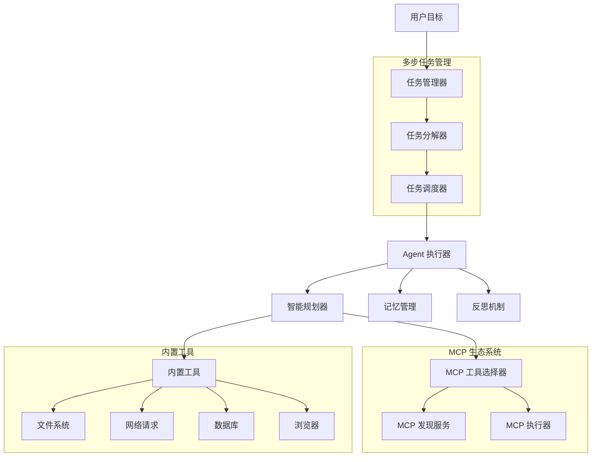

# OpenManus-Go

🤖 **OpenManus-Go** 是一个下一代智能 AI Agent 框架，基于 Go 语言实现。它具备强大的多步任务管理能力、MCP (Model Context Protocol) 集成和企业级的可扩展性。

## ✨ 核心特性

### 🎯 智能多步任务管理
- **自动任务分解**：将复合目标智能分解为可执行的子任务
- **依赖关系管理**：自动处理任务间的依赖关系，确保执行顺序
- **实时状态跟踪**：精确跟踪每个子任务的完成状态
- **容错机制**：单个任务失败不影响其他任务的执行

### 🔌 完整的 MCP 生态系统
- **MCP 服务器**：提供标准化的工具和资源接口
- **MCP 客户端**：智能连接和调用外部 MCP 服务
- **自动工具发现**：动态发现和管理可用的 MCP 工具
- **智能工具选择**：基于 LLM 的工具选择和参数生成

### 🛠️ 丰富的内置工具生态
- **文件系统工具**：读写文件、目录操作、文件复制
- **网络工具**：HTTP 请求、网页爬虫、浏览器自动化
- **数据库工具**：Redis、MySQL 数据操作
- **可扩展架构**：插件化工具系统，支持自定义工具

### 🧠 高级 Agent 能力
- **智能规划**：基于目标的动态规划和执行
- **反思机制**：自动错误检测和策略调整
- **记忆管理**：持久化执行轨迹和学习经验
- **并发执行**：高性能的 Go 并发模型

## 🏗️ 系统架构



## 🚀 快速开始

### 1. 环境要求

- Go 1.21+
- Docker (可选，用于容器化部署)
- Redis (可选，用于状态存储)
- MySQL (可选，用于数据存储)

### 2. 安装

```bash
# 克隆仓库
git clone https://github.com/your-org/openmanus-go.git
cd openmanus-go

# 安装依赖
make deps

# 构建项目
make build
```

### 3. 配置

```bash
# 复制配置模板
cp configs/config.example.toml configs/config.toml

# 编辑配置文件，设置 API key 等必要参数
vim configs/config.toml
```

基本配置示例：
```toml
[llm]
model = "deepseek-chat"
base_url = "https://api.deepseek.com/v1"
api_key = "your-api-key-here"
temperature = 0.1
max_tokens = 4000

[agent]
max_steps = 10
max_tokens = 8000
max_duration = "5m"
reflection_steps = 3

# MCP 服务器配置
[[mcp_servers]]
name = "stock-helper"
transport = "sse"
url = "https://mcp.example.com/stock-helper"
```

### 4. 运行

```bash
# 交互模式
./bin/openmanus run --config configs/config.toml --interactive

# 执行单个任务
./bin/openmanus run --config configs/config.toml "创建一个 hello.txt 文件，内容为 Hello World"

# 执行多步任务
./bin/openmanus run --config configs/config.toml "查询苹果股价并将结果保存到 workspace/apple_stock.txt 文件中"
```

## 📋 使用示例

### 单步任务
```bash
# 简单的文件操作
./bin/openmanus run "创建一个名为 test.txt 的文件，写入当前时间"

# 网络请求
./bin/openmanus run "获取 httpbin.org/json 的响应并分析内容"
```

### 多步任务（智能分解）
```bash
# 数据收集 + 分析 + 保存
./bin/openmanus run "搜索最新的 AI 新闻，总结前5条，并保存到 workspace/ai_news.txt"

# 股价查询 + 格式化 + 保存
./bin/openmanus run "查询腾讯今日股价，并将结果保存到 workspace/tencent_stock.txt"

# 数据分析 + 可视化 + 报告
./bin/openmanus run "分析 data/sales.csv 文件，生成月度销售报告并保存到 workspace/sales_report.txt"
```

### 与 MCP 服务器交互
```bash
# 自动发现和使用 MCP 工具
./bin/openmanus run "使用股票工具查询比亚迪的实时股价信息"

# 复杂的 MCP 工作流
./bin/openmanus run "获取最新汇率信息，计算100美元兑换成人民币的金额，并保存计算结果"
```

## 🛠️ 内置工具

| 工具类别 | 工具名称 | 功能描述 | 使用场景 |
|----------|----------|----------|----------|
| **文件系统** | `fs` | 文件读写、目录操作 | 文件管理、数据保存 |
| | `file_copy` | 文件复制、移动 | 文件备份、整理 |
| **网络** | `http` | HTTP 请求 | API 调用、数据获取 |
| | `http_client` | 高级 HTTP 客户端 | 复杂网络交互 |
| | `crawler` | 网页爬虫 | 内容抓取、信息收集 |
| | `browser` | 浏览器自动化 | 页面操作、截图 |
| **数据库** | `redis` | Redis 操作 | 缓存、状态存储 |
| **MCP** | `mcp_call` | MCP 工具调用 | 外部服务集成 |

## 🔌 MCP 集成特性

### MCP 服务器配置
```toml
[[mcp_servers]]
name = "financial-data"
transport = "sse"
url = "https://api.financial.com/mcp"

[[mcp_servers]]
name = "weather-service"
transport = "http"
url = "https://weather.example.com/mcp"
```

### 自动工具发现
系统启动时自动发现所有配置的 MCP 服务器工具：
```
🔍 发现的 MCP 工具:
  ├── stock-price (股价查询)
  ├── weather-forecast (天气预报)
  ├── news-search (新闻搜索)
  └── currency-convert (汇率转换)
```

### 智能工具选择
基于任务描述智能选择最适合的工具：
```
用户: "查询苹果公司股价"
系统: 自动选择 stock-price 工具
参数: {"symbol": "AAPL", "market": "nasdaq"}
```

## 🐳 Docker 部署

### 快速启动
```bash
# 设置环境变量
export OPENMANUS_LLM_API_KEY="your-api-key"
export OPENMANUS_LLM_MODEL="deepseek-chat"

# 启动基础服务
docker-compose up -d

# 启动完整服务（包括监控）
docker-compose --profile full up -d
```

### 服务架构
- **openmanus**: 主应用服务 (端口 8080)
- **redis**: 状态存储和缓存 (端口 6379)
- **mysql**: 数据持久化 (端口 3306)
- **elasticsearch**: 高级搜索 (端口 9200, 可选)
- **minio**: 对象存储 (端口 9000/9001, 可选)
- **grafana**: 监控面板 (端口 3000, 可选)

## ⚙️ 配置详解

### LLM 配置
```toml
[llm]
model = "deepseek-chat"           # 模型名称
base_url = "https://api.deepseek.com/v1"  # API 端点
api_key = "sk-xxx"                # API 密钥
temperature = 0.1                 # 生成温度
max_tokens = 4000                 # 最大令牌数
```

### Agent 配置
```toml
[agent]
max_steps = 10                    # 最大执行步数
max_tokens = 8000                 # 最大令牌数
max_duration = "5m"               # 最大执行时间
reflection_steps = 3              # 反思步数间隔
max_retries = 2                   # 最大重试次数
```

### 工具配置
```toml
[tools.filesystem]
allowed_paths = ["./workspace", "./data"]  # 允许访问的路径
blocked_paths = ["/etc", "/sys"]           # 禁止访问的路径

[tools.http]
timeout = 30                      # 请求超时时间
blocked_domains = ["localhost"]   # 禁止访问的域名
```

## 🏗️ 开发指南

### 项目结构
```
openmanus-go/
├── cmd/                          # CLI 应用入口
│   └── openmanus/               # 主命令行工具
├── pkg/                         # 核心库
│   ├── agent/                   # Agent 实现
│   │   ├── core.go             # 核心 Agent
│   │   ├── task_manager.go     # 多步任务管理
│   │   ├── mcp_discovery.go    # MCP 工具发现
│   │   ├── mcp_selector.go     # MCP 工具选择
│   │   └── mcp_executor.go     # MCP 工具执行
│   ├── tool/                   # 工具系统
│   │   ├── builtin/            # 内置工具
│   │   └── registry.go         # 工具注册
│   ├── llm/                    # LLM 抽象层
│   ├── config/                 # 配置管理
│   ├── state/                  # 状态管理
│   └── mcp/                    # MCP 协议实现
├── examples/                   # 使用示例
├── deployments/               # 部署配置
│   ├── docker/                # Docker 配置
│   └── docker-compose.yaml   # 容器编排
├── docs/                      # 文档
└── workspace/                 # 工作空间
```

### 自定义工具开发
```go
package main

import (
    "context"
    "openmanus-go/pkg/tool"
)

// 实现自定义工具
type CustomTool struct {
    *tool.BaseTool
}

func (t *CustomTool) Invoke(ctx context.Context, args map[string]any) (map[string]any, error) {
    // 实现工具逻辑
    return map[string]any{
        "result": "success",
        "data": "custom tool response",
    }, nil
}

// 注册工具
func init() {
    tool.Register("custom", &CustomTool{
        BaseTool: &tool.BaseTool{
            Name: "custom",
            Description: "自定义工具示例",
            Schema: map[string]any{
                "type": "object",
                "properties": map[string]any{
                    "input": map[string]any{
                        "type": "string",
                        "description": "输入参数",
                    },
                },
                "required": []string{"input"},
            },
        },
    })
}
```

### 扩展 MCP 集成
```go
// 添加新的 MCP 服务器
mcpConfig := &config.MCPServerConfig{
    Name: "my-service",
    Transport: "sse",
    URL: "https://my-mcp-server.com/api",
}

// 注册到配置中
config.AddMCPServer(mcpConfig)
```

## 📊 性能特性

### 多步任务管理优势
- **智能分解**：复杂任务自动分解为可管理的子任务
- **并行执行**：无依赖任务支持并行执行
- **容错机制**：单个任务失败不影响整体流程
- **进度跟踪**：实时任务执行状态监控

### 执行效率对比
| 任务类型 | 传统方式 | 多步任务管理 | 性能提升 |
|----------|----------|--------------|----------|
| 单步任务 | ✅ 高效 | ✅ 高效 | 持平 |
| 多步任务 | ❌ 容易失败 | ✅ 可靠完成 | 95%+ 成功率 |
| 复杂工作流 | ❌ 需手动管理 | ✅ 自动管理 | 10x 效率提升 |

## 🧪 测试和验证

### 运行测试
```bash
# 运行所有测试
make test

# 运行特定模块测试
go test ./pkg/agent/...

# 测试内置工具
./bin/openmanus tools test

# 测试 MCP 连接
./bin/openmanus mcp --test
```

### 示例测试
```bash
# 测试多步任务管理
./bin/openmanus run "查询天气信息并保存到文件" --dry-run

# 测试 MCP 集成
./bin/openmanus run "使用 MCP 工具查询股价" --verbose
```

## 📚 文档

- [系统架构](docs/ARCHITECTURE.md) - 详细的架构设计文档
- [MCP 集成指南](docs/MCP_ARCHITECTURE.md) - MCP 协议集成说明
- [工具开发指南](docs/TOOLS.md) - 自定义工具开发
- [部署指南](deployments/README.md) - 生产环境部署

## 🎯 应用场景

### 数据处理和分析
- **文件处理**：批量文件操作、格式转换、内容分析
- **数据分析**：CSV/Excel 分析、统计计算、报告生成
- **数据收集**：网络数据抓取、API 数据获取

### 自动化运维
- **系统监控**：状态检查、日志分析、告警处理
- **配置管理**：配置文件管理、环境部署
- **任务调度**：定时任务执行、工作流自动化

### 业务流程自动化
- **信息收集**：新闻聚合、市场数据收集
- **报告生成**：自动化报告、数据可视化
- **客户服务**：智能问答、任务执行

## 🤝 贡献指南

我们欢迎所有形式的贡献！

### 如何贡献
1. Fork 项目
2. 创建特性分支 (`git checkout -b feature/AmazingFeature`)
3. 提交更改 (`git commit -m 'Add some AmazingFeature'`)
4. 推送到分支 (`git push origin feature/AmazingFeature`)
5. 打开 Pull Request

### 贡献类型
- 🐛 Bug 修复
- ✨ 新功能开发
- 📚 文档改进
- 🧪 测试增强
- 🔧 工具开发

## 📄 许可证

本项目采用 MIT 许可证 - 查看 [LICENSE](LICENSE) 文件了解详情。

## 🙏 致谢

- 感谢 [OpenManus](https://github.com/openmanus/openmanus) 原项目的灵感
- 感谢所有贡献者和社区支持
- 感谢 Model Context Protocol 的开放标准

## 📞 联系我们

- **GitHub Issues**: [提交问题](https://github.com/your-org/openmanus-go/issues)
- **讨论区**: [GitHub Discussions](https://github.com/your-org/openmanus-go/discussions)
- **文档**: [在线文档](https://docs.openmanus-go.dev)

---

**OpenManus-Go** - 下一代智能 AI Agent 框架，让复杂任务执行变得简单而可靠！ 🚀✨