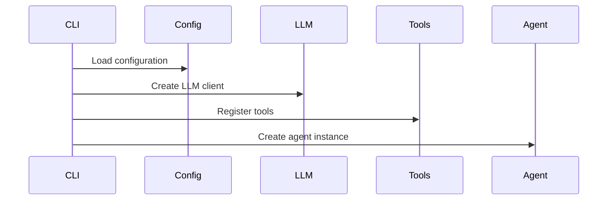
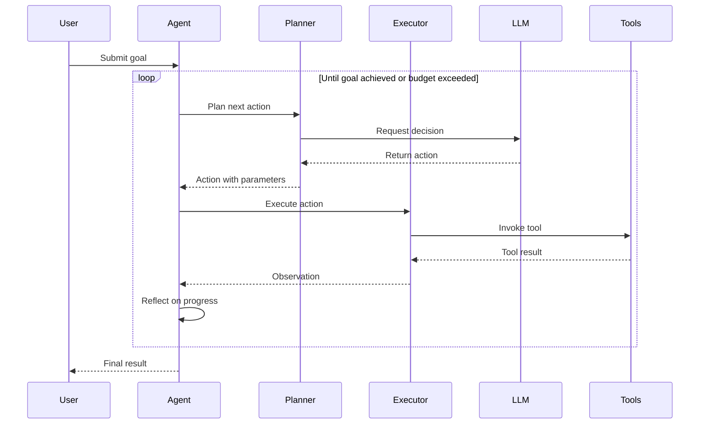

# OpenManus-Go 架构设计

本文档详细描述了 OpenManus-Go 的架构设计、核心组件和设计决策。

## 总体架构

OpenManus-Go 采用模块化架构，主要包含以下核心组件：

```
┌─────────────────────────────────────────────────────────┐
│                    CLI Interface                        │
├─────────────────────────────────────────────────────────┤
│                   Agent Layer                           │
│  ┌─────────────┐ ┌─────────────┐ ┌─────────────────────┐ │
│  │   Planner   │ │  Reflector  │ │      Memory         │ │
│  └─────────────┘ └─────────────┘ └─────────────────────┘ │
├─────────────────────────────────────────────────────────┤
│                   Tool Layer                            │
│  ┌─────────────┐ ┌─────────────┐ ┌─────────────────────┐ │
│  │  Registry   │ │  Executor   │ │   Builtin Tools     │ │
│  └─────────────┘ └─────────────┘ └─────────────────────┘ │
├─────────────────────────────────────────────────────────┤
│                   LLM Layer                             │
│  ┌─────────────┐ ┌─────────────┐ ┌─────────────────────┐ │
│  │   Client    │ │   OpenAI    │ │    Anthropic        │ │
│  └─────────────┘ └─────────────┘ └─────────────────────┘ │
├─────────────────────────────────────────────────────────┤
│                 Infrastructure                          │
│  ┌─────────────┐ ┌─────────────┐ ┌─────────────────────┐ │
│  │   Config    │ │   Storage   │ │      Logging        │ │
│  └─────────────┘ └─────────────┘ └─────────────────────┘ │
└─────────────────────────────────────────────────────────┘
```

## 核心组件

### 1. Agent 层

#### BaseAgent
- **职责**：协调整个执行循环
- **核心方法**：
  - `Plan()`: 规划下一步动作
  - `Act()`: 执行动作
  - `Reflect()`: 反思执行结果
  - `Loop()`: 完整的执行循环

#### Planner
- **职责**：基于目标和历史轨迹规划下一步动作
- **输入**：目标、执行轨迹、可用工具
- **输出**：具体的动作和参数
- **核心逻辑**：
  ```go
  func (p *Planner) Plan(ctx context.Context, goal string, trace *Trace) (Action, error) {
      // 1. 构建上下文提示
      // 2. 调用 LLM 进行决策
      // 3. 解析响应为具体动作
  }
  ```

#### Reflector
- **职责**：分析执行轨迹，提供改进建议
- **分析维度**：
  - 进度评估
  - 模式识别
  - 错误分析
  - 策略调整

#### Memory
- **职责**：管理短期和长期记忆
- **功能**：
  - 轨迹压缩
  - 上下文管理
  - 关键信息提取

### 2. Tool 层

#### Registry
- **职责**：工具注册和管理
- **功能**：
  - 工具注册/注销
  - 工具查找
  - 清单生成

#### Executor
- **职责**：工具执行和结果处理
- **功能**：
  - 参数验证
  - 超时控制
  - 错误处理
  - 重试机制

#### Built-in Tools
内置工具集合，包括：
- HTTP 工具：网络请求
- 文件系统工具：文件操作
- 数据库工具：Redis、MySQL
- 浏览器工具：网页自动化
- 爬虫工具：内容抓取

### 3. LLM 层

#### Client 接口
```go
type Client interface {
    Chat(ctx context.Context, req *ChatRequest) (*ChatResponse, error)
    ChatStream(ctx context.Context, req *ChatRequest) (<-chan *ChatResponse, error)
    GetModel() string
    SetModel(model string)
}
```

#### OpenAI 实现
- 兼容 OpenAI API
- 支持工具调用
- 流式响应支持

### 4. 状态管理

#### State Types
```go
type Trace struct {
    Goal      string
    Steps     []Step
    Budget    Budget
    Status    TraceStatus
    CreatedAt time.Time
    UpdatedAt time.Time
}
```

#### Storage 接口
```go
type Store interface {
    Save(trace *Trace) error
    Load(id string) (*Trace, error)
    List() ([]string, error)
    Delete(id string) error
}
```

## 执行流程

### 1. 初始化阶段


### 2. 执行循环


## 设计决策

### 1. 为什么选择 Go

- **性能**：编译型语言，执行效率高
- **并发**：原生协程支持，适合并发工具调用
- **部署**：单二进制文件，部署简单
- **生态**：丰富的第三方库支持

### 2. 模块化设计

- **可扩展性**：新工具和 Agent 类型容易添加
- **可测试性**：每个组件可独立测试
- **可维护性**：职责清晰，降低耦合度

### 3. 接口优先

- 所有核心组件都定义了接口
- 便于 Mock 和测试
- 支持不同实现的替换

### 4. 错误处理策略

- 使用 Go 标准错误处理模式
- 错误信息包含上下文
- 支持错误重试和降级

## 性能考虑

### 1. 并发处理
```go
// 并发执行多个工具
func (e *Executor) BatchExecute(ctx context.Context, actions []Action) ([]*Observation, error) {
    // 使用 goroutine 并发执行
}
```

### 2. 内存管理
- 轨迹压缩机制
- 定期清理过期数据
- 流式处理大数据

### 3. 缓存策略
- LLM 响应缓存
- 工具结果缓存
- 配置缓存

## 安全考虑

### 1. 工具沙箱
- 文件系统访问限制
- 网络访问白名单
- 数据库权限控制

### 2. 输入验证
- JSON Schema 验证
- 参数类型检查
- 长度和范围限制

### 3. 敏感信息保护
- API Key 掩码显示
- 日志脱敏
- 配置加密存储

## 扩展点

### 1. 自定义工具
```go
type CustomTool struct {
    *tool.BaseTool
}

func (t *CustomTool) Invoke(ctx context.Context, args map[string]any) (map[string]any, error) {
    // 自定义逻辑
}
```

### 2. 自定义 Agent
```go
type CustomAgent struct {
    *agent.BaseAgent
}

func (a *CustomAgent) Plan(ctx context.Context, goal string, trace *Trace) (Action, error) {
    // 自定义规划逻辑
}
```

### 3. 自定义存储
```go
type CustomStore struct{}

func (s *CustomStore) Save(trace *Trace) error {
    // 自定义存储逻辑
}
```

## 监控和观测

### 1. 指标收集
- 执行时间
- 成功率
- 工具使用统计
- 错误率

### 2. 日志记录
- 结构化日志
- 不同级别日志
- 上下文信息

### 3. 链路追踪
- 请求 ID 追踪
- 执行轨迹记录
- 性能瓶颈识别

## 未来规划

### 1. 多 Agent 协作
- Agent 间通信协议
- 任务分解和分配
- 结果聚合机制

### 2. 强化学习
- 策略优化
- 奖励机制设计
- 在线学习支持

### 3. 可视化界面
- Web 控制台
- 实时监控
- 交互式调试
