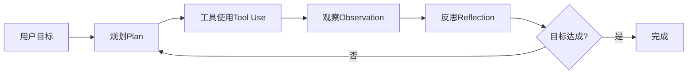
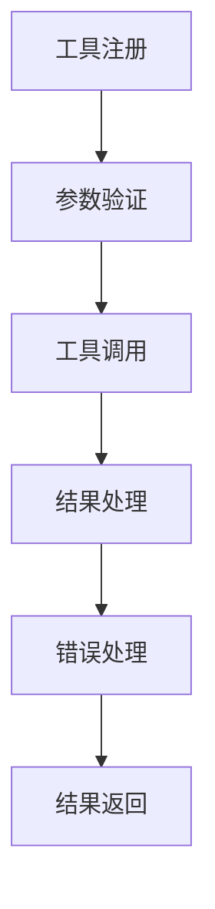
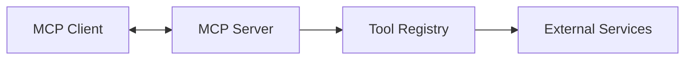

# 核心概念

本文档介绍 OpenManus-Go 的核心概念和设计理念，帮助您深入理解框架的工作原理。

## 🧠 AI Agent 基础

### 什么是 AI Agent？

AI Agent 是一个能够感知环境、做出决策并执行行动以实现目标的智能系统。OpenManus-Go 实现了基于大语言模型（LLM）的 Agent 架构。

### Agent 执行循环

OpenManus-Go 采用经典的 **Plan → Tool Use → Observation → Reflection** 循环：



### 执行流程详解

1. **Plan（规划）**
   - 分析当前状态和目标
   - 选择下一步最优行动
   - 确定需要使用的工具和参数

2. **Tool Use（工具使用）**
   - 调用选定的工具
   - 传递必要的参数
   - 处理工具执行

3. **Observation（观察）**
   - 收集工具执行结果
   - 分析输出和状态变化
   - 记录关键信息

4. **Reflection（反思）**
   - 评估当前进度
   - 分析成功和失败
   - 调整后续策略

## 🏗️ 核心组件

### 1. Agent（智能体）

Agent 是系统的核心控制器，负责协调整个执行过程。

```go
type Agent interface {
    Loop(ctx context.Context, goal string) (*state.Trace, error)
    Plan(ctx context.Context, goal string, trace *state.Trace) (*state.Action, error)
    Act(ctx context.Context, action *state.Action) (*state.Observation, error)
    Reflect(ctx context.Context, trace *state.Trace) (*state.Reflection, error)
}
```

**职责**：
- 任务规划和分解
- 工具选择和调用
- 执行监控和控制
- 结果评估和反思

### 2. Tool（工具）

工具是 Agent 与外部世界交互的接口，提供具体的功能实现。

```go
type Tool interface {
    Name() string
    Description() string
    InputSchema() map[string]any
    OutputSchema() map[string]any
    Invoke(ctx context.Context, args map[string]any) (map[string]any, error)
}
```

**分类**：
- **系统工具**：文件操作、网络请求
- **数据工具**：数据库操作、数据处理
- **交互工具**：浏览器自动化、用户接口
- **外部工具**：第三方API、MCP服务

### 3. LLM Client（语言模型客户端）

LLM 客户端负责与大语言模型通信，提供决策支持。

```go
type Client interface {
    Chat(ctx context.Context, req *ChatRequest) (*ChatResponse, error)
    ChatStream(ctx context.Context, req *ChatRequest) (<-chan *ChatResponse, error)
    GetModel() string
    SetModel(model string)
}
```

**功能**：
- 理解用户意图
- 生成执行计划
- 选择合适工具
- 分析执行结果

### 4. State（状态管理）

状态管理系统负责记录和维护执行轨迹。

```go
type Trace struct {
    ID       string          `json:"id"`
    Goal     string          `json:"goal"`
    Steps    []Step          `json:"steps"`
    Budget   Budget          `json:"budget"`
    Status   TraceStatus     `json:"status"`
    CreatedAt time.Time      `json:"created_at"`
    UpdatedAt time.Time      `json:"updated_at"`
}
```

**组成**：
- **Trace（轨迹）**：完整的执行记录
- **Step（步骤）**：单个执行步骤
- **Action（行动）**：具体的工具调用
- **Observation（观察）**：工具执行结果

## 🔧 工具系统

### 工具生命周期



### 工具注册

```go
// 注册内置工具
func RegisterBuiltinTools(registry *Registry) {
    registry.Register(NewHTTPTool())
    registry.Register(NewFileSystemTool())
    registry.Register(NewBrowserTool())
    // ... 更多工具
}
```

### 工具发现

Agent 通过工具注册表发现和选择工具：

```go
// 获取工具清单（供LLM使用）
manifest := registry.GetToolsManifest()

// 根据名称获取工具
tool, exists := registry.Get("http")
```

### 参数验证

所有工具调用都经过严格的参数验证：

```go
// JSON Schema 验证
func (t *HTTPTool) validateArgs(args map[string]any) error {
    return validator.Validate(args, t.InputSchema())
}
```

## 🔄 执行控制

### 预算管理

系统支持多种预算控制机制：

```go
type Budget struct {
    MaxSteps    int           `json:"max_steps"`
    MaxTokens   int           `json:"max_tokens"`
    MaxDuration time.Duration `json:"max_duration"`
    
    UsedSteps   int           `json:"used_steps"`
    UsedTokens  int           `json:"used_tokens"`
    UsedTime    time.Duration `json:"used_time"`
}
```

**预算类型**：
- **步数预算**：限制最大执行步数
- **令牌预算**：控制LLM调用成本
- **时间预算**：防止无限执行

### 错误处理

系统提供多层错误处理机制：

1. **工具级错误**：工具内部错误处理
2. **执行级错误**：工具调用失败重试
3. **Agent级错误**：整体策略调整
4. **系统级错误**：框架级异常处理

### 并发控制

支持安全的并发执行：

```go
// 并发工具调用
func (e *Executor) BatchExecute(ctx context.Context, actions []Action) ([]*Observation, error) {
    // 使用 worker pool 控制并发
    return e.workerPool.Execute(ctx, actions)
}
```

## 🌐 MCP 集成

### Model Context Protocol

MCP 是一个标准化协议，用于AI模型与工具和服务之间的通信。



### 协议特性

- **标准化接口**：统一的工具描述和调用
- **类型安全**：JSON Schema 参数验证
- **协议版本**：向后兼容的版本管理
- **传输层无关**：支持HTTP、WebSocket等

### 双向支持

OpenManus-Go 同时支持：
- **MCP 服务器**：暴露内置工具为MCP服务
- **MCP 客户端**：连接外部MCP服务器

## 🚀 多Agent协作

### 工作流模式

支持三种主要的执行模式：

1. **Sequential（顺序）**
   ```
   Agent1 → Agent2 → Agent3
   ```

2. **Parallel（并行）**
   ```
   Agent1
   Agent2  } 同时执行
   Agent3
   ```

3. **DAG（有向无环图）**
   ```
   Agent1 → Agent2
   ↓         ↓
   Agent3 → Agent4
   ```

### 依赖管理

```go
type Task struct {
    ID           string            `json:"id"`
    Name         string            `json:"name"`
    AgentType    string            `json:"agent_type"`
    Goal         string            `json:"goal"`
    Dependencies []string          `json:"dependencies"`
    Input        map[string]any    `json:"input"`
    Output       map[string]any    `json:"output"`
}
```

### 事件系统

```go
type Event struct {
    Type      EventType   `json:"type"`
    Timestamp time.Time   `json:"timestamp"`
    Message   string      `json:"message"`
    Data      any         `json:"data,omitempty"`
}
```

## 🔐 安全机制

### 访问控制

```toml
[tools.filesystem]
allowed_paths = ["./workspace", "./data"]
blocked_paths = ["/etc", "/sys", "/proc"]

[tools.http]
allowed_domains = ["api.example.com"]
blocked_domains = ["malicious.com"]
```

### 输入验证

- **JSON Schema验证**：严格的参数类型检查
- **路径验证**：防止目录遍历攻击
- **URL验证**：防止SSRF攻击
- **大小限制**：防止资源耗尽

### 权限管理

- **工具权限**：细粒度的工具访问控制
- **资源限制**：内存、CPU、网络限制
- **审计日志**：完整的操作记录

## 📊 可观测性

### 执行轨迹

每次执行都会生成详细的轨迹记录：

```json
{
  "id": "trace-123",
  "goal": "创建报告文件",
  "steps": [
    {
      "action": {"name": "fs", "args": {...}},
      "observation": {"success": true, "result": {...}},
      "reflection": "文件创建成功，继续下一步"
    }
  ]
}
```

### 性能指标

- **执行时间**：各组件响应时间
- **资源使用**：内存、CPU使用情况  
- **成功率**：任务完成率和错误率
- **工具统计**：工具使用频率和性能

### 调试支持

- **详细日志**：结构化的调试信息
- **执行可视化**：轨迹可视化展示
- **性能分析**：瓶颈识别和优化建议

## 🔮 扩展性设计

### 插件架构

```go
// 自定义Agent类型
type CustomAgent struct {
    *agent.BaseAgent
}

func (a *CustomAgent) Plan(ctx context.Context, goal string, trace *state.Trace) (*state.Action, error) {
    // 自定义规划逻辑
}
```

### 配置驱动

```toml
# 运行时配置
[agent]
max_steps = 20
reflection_enabled = true
custom_strategies = ["advanced_planning"]

[tools]
enabled = ["fs", "http", "custom_tool"]
disabled = ["browser"]
```

### 接口设计

所有核心组件都基于接口设计，支持：
- **依赖注入**：灵活的组件组合
- **单元测试**：可测试的架构
- **扩展开发**：第三方扩展支持

## 🧪 测试策略

### 测试层次

1. **单元测试**：组件级功能测试
2. **集成测试**：组件间交互测试  
3. **端到端测试**：完整流程测试
4. **性能测试**：负载和压力测试

### Mock支持

```go
type MockLLMClient struct{}

func (m *MockLLMClient) Chat(ctx context.Context, req *ChatRequest) (*ChatResponse, error) {
    // 返回预定义响应
    return &ChatResponse{Content: "mocked response"}, nil
}
```

---

理解这些核心概念后，您就可以更好地使用和扩展 OpenManus-Go 了！

**下一步推荐**：[架构设计](ARCHITECTURE.md) → [工具开发](TOOLS.md) → [API参考](API_REFERENCE.md)
