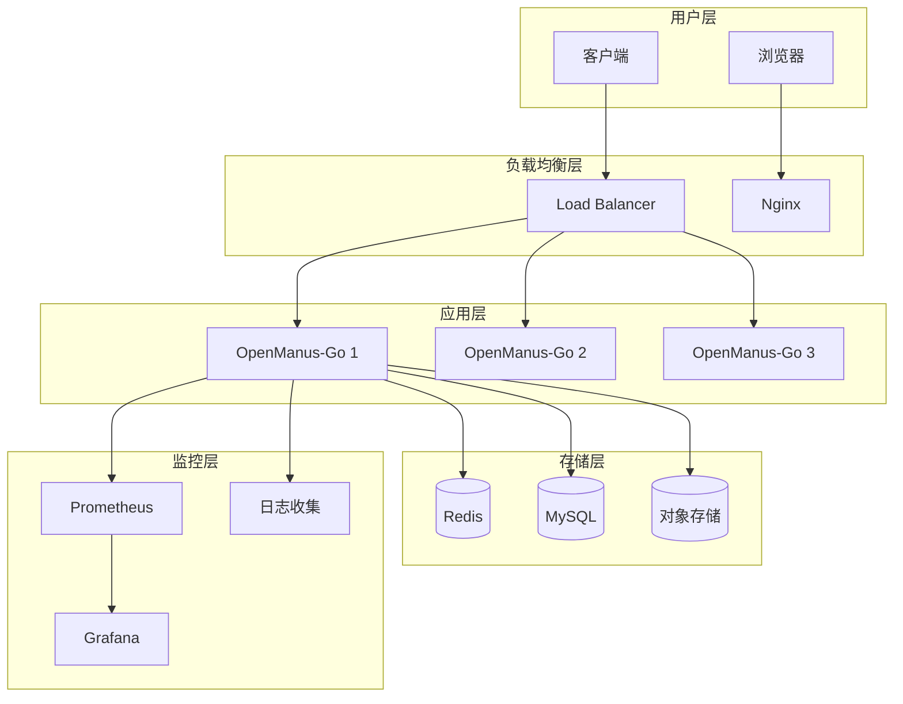

# 部署指南

本文档详细介绍 OpenManus-Go 在不同环境中的部署方案，包括单机部署、容器化部署和云原生部署。

## 📋 目录

- [部署概述](#部署概述)
- [单机部署](#单机部署)
- [Docker 部署](#docker-部署)
- [Docker Compose](#docker-compose)
- [Kubernetes 部署](#kubernetes-部署)
- [云平台部署](#云平台部署)
- [高可用部署](#高可用部署)
- [监控配置](#监控配置)

## 🎯 部署概述

OpenManus-Go 支持多种部署方式：

| 部署方式 | 适用场景 | 复杂度 | 可扩展性 |
|----------|----------|--------|----------|
| 单机部署 | 开发测试 | 低 | 低 |
| Docker 容器 | 小规模生产 | 中 | 中 |
| Kubernetes | 大规模生产 | 高 | 高 |
| 云托管 | 企业级应用 | 中 | 高 |

### 部署架构



## 🖥️ 单机部署

适用于开发环境和小规模应用。

### 环境准备

```bash
# 系统要求
# - CPU: 2 核及以上
# - 内存: 4GB 及以上
# - 磁盘: 10GB 及以上
# - 网络: 稳定的互联网连接

# 安装依赖
# Ubuntu/Debian
sudo apt update
sudo apt install -y git curl wget

# CentOS/RHEL
sudo yum update
sudo yum install -y git curl wget

# macOS
brew install git curl wget
```

### 构建部署

```bash
# 1. 克隆项目
git clone https://github.com/your-org/openmanus-go.git
cd openmanus-go

# 2. 构建项目
make build

# 3. 准备配置
cp configs/config.example.toml configs/config.toml
vim configs/config.toml  # 编辑配置

# 4. 创建必要目录
mkdir -p workspace data logs

# 5. 设置权限
chmod +x bin/openmanus

# 6. 运行服务
./bin/openmanus run --config configs/config.toml --interactive
```

### 系统服务配置

#### systemd 服务 (Linux)

创建服务文件 `/etc/systemd/system/openmanus.service`:

```ini
[Unit]
Description=OpenManus-Go AI Agent Service
After=network.target

[Service]
Type=simple
User=openmanus
Group=openmanus
WorkingDirectory=/opt/openmanus-go
ExecStart=/opt/openmanus-go/bin/openmanus run --config /opt/openmanus-go/configs/config.toml
Restart=always
RestartSec=10
Environment=OPENMANUS_API_KEY=your-api-key
StandardOutput=journal
StandardError=journal

[Install]
WantedBy=multi-user.target
```

启动服务:
```bash
# 重载配置
sudo systemctl daemon-reload

# 启动服务
sudo systemctl start openmanus

# 开机自启
sudo systemctl enable openmanus

# 查看状态
sudo systemctl status openmanus

# 查看日志
sudo journalctl -u openmanus -f
```

#### launchd 服务 (macOS)

创建服务文件 `~/Library/LaunchAgents/com.openmanus.agent.plist`:

```xml
<?xml version="1.0" encoding="UTF-8"?>
<!DOCTYPE plist PUBLIC "-//Apple//DTD PLIST 1.0//EN" "http://www.apple.com/DTDs/PropertyList-1.0.dtd">
<plist version="1.0">
<dict>
    <key>Label</key>
    <string>com.openmanus.agent</string>
    <key>ProgramArguments</key>
    <array>
        <string>/usr/local/bin/openmanus</string>
        <string>run</string>
        <string>--config</string>
        <string>/usr/local/etc/openmanus/config.toml</string>
    </array>
    <key>RunAtLoad</key>
    <true/>
    <key>KeepAlive</key>
    <true/>
    <key>StandardOutPath</key>
    <string>/usr/local/var/log/openmanus.log</string>
    <key>StandardErrorPath</key>
    <string>/usr/local/var/log/openmanus-error.log</string>
</dict>
</plist>
```

启动服务:
```bash
# 加载服务
launchctl load ~/Library/LaunchAgents/com.openmanus.agent.plist

# 启动服务
launchctl start com.openmanus.agent

# 查看状态
launchctl list | grep openmanus
```

## 🐳 Docker 部署

适用于需要环境隔离和快速部署的场景。

### Dockerfile

```dockerfile
# 多阶段构建
FROM golang:1.21-alpine AS builder

WORKDIR /app

# 安装构建依赖
RUN apk add --no-cache git make

# 复制依赖文件
COPY go.mod go.sum ./
RUN go mod download

# 复制源码
COPY . .

# 构建应用
RUN make build

# 生产镜像
FROM alpine:latest

# 安装运行时依赖
RUN apk --no-cache add ca-certificates chromium

# 创建用户
RUN addgroup -g 1001 -S openmanus && \
    adduser -u 1001 -S openmanus -G openmanus

# 设置工作目录
WORKDIR /app

# 复制构建产物
COPY --from=builder /app/bin/openmanus /app/
COPY --from=builder /app/configs/config.example.toml /app/configs/

# 创建必要目录
RUN mkdir -p workspace data logs && \
    chown -R openmanus:openmanus /app

# 切换用户
USER openmanus

# 设置环境变量
ENV CHROME_BIN=/usr/bin/chromium-browser
ENV CHROME_PATH=/usr/bin/chromium-browser

# 暴露端口
EXPOSE 8080

# 健康检查
HEALTHCHECK --interval=30s --timeout=10s --start-period=30s --retries=3 \
    CMD wget --no-verbose --tries=1 --spider http://localhost:8080/health || exit 1

# 启动命令
CMD ["./openmanus", "run", "--config", "configs/config.toml", "--interactive"]
```

### 构建和运行

```bash
# 构建镜像
docker build -t openmanus-go:latest .

# 运行容器
docker run -d \
  --name openmanus \
  -p 8080:8080 \
  -v $(pwd)/configs:/app/configs \
  -v $(pwd)/workspace:/app/workspace \
  -v $(pwd)/data:/app/data \
  -e OPENMANUS_API_KEY="your-api-key" \
  openmanus-go:latest

# 查看日志
docker logs -f openmanus

# 进入容器
docker exec -it openmanus sh

# 停止容器
docker stop openmanus

# 删除容器
docker rm openmanus
```

### 优化镜像

#### 多架构镜像

```bash
# 创建多架构构建器
docker buildx create --name multiarch --use

# 构建多架构镜像
docker buildx build \
  --platform linux/amd64,linux/arm64 \
  -t openmanus-go:latest \
  --push .
```

#### 镜像瘦身

```dockerfile
# 使用 distroless 基础镜像
FROM gcr.io/distroless/base-debian11:latest

# 或使用 scratch
FROM scratch
COPY ca-certificates.crt /etc/ssl/certs/
```

## 🐙 Docker Compose

适用于多服务协调部署。

### 基础版本

`docker-compose.yml`:

```yaml
version: '3.8'

services:
  openmanus:
    build: .
    ports:
      - "8080:8080"
    volumes:
      - ./configs:/app/configs
      - ./workspace:/app/workspace
      - ./data:/app/data
    environment:
      - OPENMANUS_API_KEY=${OPENMANUS_API_KEY}
      - REDIS_URL=redis:6379
      - MYSQL_DSN=openmanus:password@tcp(mysql:3306)/openmanus
    depends_on:
      - redis
      - mysql
    restart: unless-stopped
    
  redis:
    image: redis:7-alpine
    ports:
      - "6379:6379"
    volumes:
      - redis_data:/data
    restart: unless-stopped
    
  mysql:
    image: mysql:8.0
    ports:
      - "3306:3306"
    environment:
      - MYSQL_ROOT_PASSWORD=rootpassword
      - MYSQL_DATABASE=openmanus
      - MYSQL_USER=openmanus
      - MYSQL_PASSWORD=password
    volumes:
      - mysql_data:/var/lib/mysql
    restart: unless-stopped

volumes:
  redis_data:
  mysql_data:
```

### 完整版本（包含监控）

`docker-compose.full.yml`:

```yaml
version: '3.8'

services:
  openmanus:
    build: .
    ports:
      - "8080:8080"
    volumes:
      - ./configs:/app/configs
      - ./workspace:/app/workspace
      - ./data:/app/data
    environment:
      - OPENMANUS_API_KEY=${OPENMANUS_API_KEY}
      - REDIS_URL=redis:6379
      - MYSQL_DSN=openmanus:password@tcp(mysql:3306)/openmanus
    depends_on:
      - redis
      - mysql
    restart: unless-stopped
    networks:
      - openmanus
    
  redis:
    image: redis:7-alpine
    volumes:
      - redis_data:/data
    restart: unless-stopped
    networks:
      - openmanus
    
  mysql:
    image: mysql:8.0
    environment:
      - MYSQL_ROOT_PASSWORD=rootpassword
      - MYSQL_DATABASE=openmanus
      - MYSQL_USER=openmanus
      - MYSQL_PASSWORD=password
    volumes:
      - mysql_data:/var/lib/mysql
    restart: unless-stopped
    networks:
      - openmanus
      
  nginx:
    image: nginx:alpine
    ports:
      - "80:80"
      - "443:443"
    volumes:
      - ./nginx/nginx.conf:/etc/nginx/nginx.conf
      - ./nginx/ssl:/etc/nginx/ssl
    depends_on:
      - openmanus
    restart: unless-stopped
    networks:
      - openmanus
      
  prometheus:
    image: prom/prometheus:latest
    ports:
      - "9090:9090"
    volumes:
      - ./monitoring/prometheus.yml:/etc/prometheus/prometheus.yml
      - prometheus_data:/prometheus
    restart: unless-stopped
    networks:
      - openmanus
      
  grafana:
    image: grafana/grafana:latest
    ports:
      - "3000:3000"
    environment:
      - GF_SECURITY_ADMIN_PASSWORD=admin
    volumes:
      - grafana_data:/var/lib/grafana
      - ./monitoring/grafana:/etc/grafana/provisioning
    restart: unless-stopped
    networks:
      - openmanus

networks:
  openmanus:
    driver: bridge

volumes:
  redis_data:
  mysql_data:
  prometheus_data:
  grafana_data:
```

### 部署命令

```bash
# 设置环境变量
export OPENMANUS_API_KEY="your-api-key"

# 启动基础服务
docker-compose up -d

# 启动完整服务（包含监控）
docker-compose -f docker-compose.full.yml up -d

# 查看服务状态
docker-compose ps

# 查看日志
docker-compose logs -f openmanus

# 停止服务
docker-compose down

# 清理数据
docker-compose down -v
```

## ☸️ Kubernetes 部署

适用于大规模、高可用的生产环境。

### 命名空间

`namespace.yaml`:

```yaml
apiVersion: v1
kind: Namespace
metadata:
  name: openmanus
  labels:
    name: openmanus
```

### ConfigMap

`configmap.yaml`:

```yaml
apiVersion: v1
kind: ConfigMap
metadata:
  name: openmanus-config
  namespace: openmanus
data:
  config.toml: |
    [llm]
    model = "gpt-4"
    base_url = "https://api.openai.com/v1"
    api_key = "${OPENMANUS_API_KEY}"
    temperature = 0.1
    max_tokens = 4000
    
    [agent]
    max_steps = 20
    max_duration = "15m"
    
    [server]
    host = "0.0.0.0"
    port = 8080
    
    [storage]
    type = "redis"
    
    [storage.redis]
    addr = "redis:6379"
    
    [logging]
    level = "info"
    format = "json"
    output = "console"
```

### Secret

`secret.yaml`:

```yaml
apiVersion: v1
kind: Secret
metadata:
  name: openmanus-secrets
  namespace: openmanus
type: Opaque
stringData:
  OPENMANUS_API_KEY: "your-api-key"
  REDIS_PASSWORD: "your-redis-password"
  MYSQL_PASSWORD: "your-mysql-password"
```

### Deployment

`deployment.yaml`:

```yaml
apiVersion: apps/v1
kind: Deployment
metadata:
  name: openmanus
  namespace: openmanus
  labels:
    app: openmanus
spec:
  replicas: 3
  selector:
    matchLabels:
      app: openmanus
  template:
    metadata:
      labels:
        app: openmanus
    spec:
      containers:
      - name: openmanus
        image: openmanus-go:latest
        ports:
        - containerPort: 8080
          name: http
        - containerPort: 9090
          name: metrics
        env:
        - name: OPENMANUS_API_KEY
          valueFrom:
            secretKeyRef:
              name: openmanus-secrets
              key: OPENMANUS_API_KEY
        volumeMounts:
        - name: config
          mountPath: /app/configs
        - name: workspace
          mountPath: /app/workspace
        resources:
          requests:
            memory: "512Mi"
            cpu: "250m"
          limits:
            memory: "1Gi"
            cpu: "500m"
        livenessProbe:
          httpGet:
            path: /health
            port: 8080
          initialDelaySeconds: 30
          periodSeconds: 10
        readinessProbe:
          httpGet:
            path: /health
            port: 8080
          initialDelaySeconds: 5
          periodSeconds: 5
      volumes:
      - name: config
        configMap:
          name: openmanus-config
      - name: workspace
        persistentVolumeClaim:
          claimName: openmanus-workspace
```

### Service

`service.yaml`:

```yaml
apiVersion: v1
kind: Service
metadata:
  name: openmanus
  namespace: openmanus
  labels:
    app: openmanus
spec:
  selector:
    app: openmanus
  ports:
  - name: http
    port: 8080
    targetPort: 8080
  - name: metrics
    port: 9090
    targetPort: 9090
  type: ClusterIP
```

### Ingress

`ingress.yaml`:

```yaml
apiVersion: networking.k8s.io/v1
kind: Ingress
metadata:
  name: openmanus
  namespace: openmanus
  annotations:
    nginx.ingress.kubernetes.io/rewrite-target: /
    cert-manager.io/cluster-issuer: "letsencrypt-prod"
spec:
  tls:
  - hosts:
    - openmanus.your-domain.com
    secretName: openmanus-tls
  rules:
  - host: openmanus.your-domain.com
    http:
      paths:
      - path: /
        pathType: Prefix
        backend:
          service:
            name: openmanus
            port:
              number: 8080
```

### 持久化存储

`pvc.yaml`:

```yaml
apiVersion: v1
kind: PersistentVolumeClaim
metadata:
  name: openmanus-workspace
  namespace: openmanus
spec:
  accessModes:
    - ReadWriteMany
  resources:
    requests:
      storage: 10Gi
  storageClassName: nfs-client
```

### 部署命令

```bash
# 应用所有配置
kubectl apply -f namespace.yaml
kubectl apply -f configmap.yaml
kubectl apply -f secret.yaml
kubectl apply -f pvc.yaml
kubectl apply -f deployment.yaml
kubectl apply -f service.yaml
kubectl apply -f ingress.yaml

# 查看状态
kubectl get pods -n openmanus
kubectl get svc -n openmanus
kubectl get ingress -n openmanus

# 查看日志
kubectl logs -f deployment/openmanus -n openmanus

# 扩容
kubectl scale deployment openmanus --replicas=5 -n openmanus

# 删除部署
kubectl delete namespace openmanus
```

## ☁️ 云平台部署

### AWS 部署

#### ECS 部署

`ecs-task-definition.json`:

```json
{
  "family": "openmanus",
  "networkMode": "awsvpc",
  "requiresCompatibilities": ["FARGATE"],
  "cpu": "512",
  "memory": "1024",
  "executionRoleArn": "arn:aws:iam::account:role/ecsTaskExecutionRole",
  "taskRoleArn": "arn:aws:iam::account:role/ecsTaskRole",
  "containerDefinitions": [
    {
      "name": "openmanus",
      "image": "your-account.dkr.ecr.region.amazonaws.com/openmanus-go:latest",
      "portMappings": [
        {
          "containerPort": 8080,
          "protocol": "tcp"
        }
      ],
      "environment": [
        {
          "name": "STORAGE_TYPE",
          "value": "s3"
        }
      ],
      "secrets": [
        {
          "name": "OPENMANUS_API_KEY",
          "valueFrom": "arn:aws:ssm:region:account:parameter/openmanus/api-key"
        }
      ],
      "logConfiguration": {
        "logDriver": "awslogs",
        "options": {
          "awslogs-group": "/ecs/openmanus",
          "awslogs-region": "us-east-1",
          "awslogs-stream-prefix": "ecs"
        }
      }
    }
  ]
}
```

#### CloudFormation 模板

`cloudformation.yaml`:

```yaml
AWSTemplateFormatVersion: '2010-09-09'
Description: 'OpenManus-Go ECS Deployment'

Parameters:
  ImageURI:
    Type: String
    Description: Container image URI
  
Resources:
  Cluster:
    Type: AWS::ECS::Cluster
    Properties:
      ClusterName: openmanus-cluster
      
  TaskDefinition:
    Type: AWS::ECS::TaskDefinition
    Properties:
      Family: openmanus
      Cpu: 512
      Memory: 1024
      NetworkMode: awsvpc
      RequiresCompatibilities:
        - FARGATE
      ExecutionRoleArn: !Ref ExecutionRole
      ContainerDefinitions:
        - Name: openmanus
          Image: !Ref ImageURI
          PortMappings:
            - ContainerPort: 8080
          Environment:
            - Name: STORAGE_TYPE
              Value: s3
              
  Service:
    Type: AWS::ECS::Service
    Properties:
      Cluster: !Ref Cluster
      TaskDefinition: !Ref TaskDefinition
      DesiredCount: 2
      LaunchType: FARGATE
      NetworkConfiguration:
        AwsvpcConfiguration:
          SecurityGroups:
            - !Ref SecurityGroup
          Subnets:
            - !Ref PrivateSubnet1
            - !Ref PrivateSubnet2
```

### Google Cloud 部署

#### Cloud Run 部署

```bash
# 构建并推送镜像
gcloud builds submit --tag gcr.io/PROJECT_ID/openmanus-go

# 部署到 Cloud Run
gcloud run deploy openmanus \
  --image gcr.io/PROJECT_ID/openmanus-go \
  --platform managed \
  --region us-central1 \
  --allow-unauthenticated \
  --set-env-vars OPENMANUS_API_KEY=your-api-key \
  --memory 1Gi \
  --cpu 1 \
  --concurrency 80 \
  --max-instances 10
```

### Azure 部署

#### Container Instances

```bash
# 创建资源组
az group create --name openmanus-rg --location eastus

# 创建容器实例
az container create \
  --resource-group openmanus-rg \
  --name openmanus \
  --image openmanus-go:latest \
  --cpu 1 \
  --memory 2 \
  --ports 8080 \
  --environment-variables OPENMANUS_API_KEY=your-api-key \
  --restart-policy Always
```

## 🔄 高可用部署

### 负载均衡配置

#### Nginx 配置

`nginx.conf`:

```nginx
upstream openmanus_backend {
    least_conn;
    server openmanus-1:8080 max_fails=3 fail_timeout=30s;
    server openmanus-2:8080 max_fails=3 fail_timeout=30s;
    server openmanus-3:8080 max_fails=3 fail_timeout=30s;
}

server {
    listen 80;
    server_name openmanus.your-domain.com;
    
    location / {
        proxy_pass http://openmanus_backend;
        proxy_set_header Host $host;
        proxy_set_header X-Real-IP $remote_addr;
        proxy_set_header X-Forwarded-For $proxy_add_x_forwarded_for;
        proxy_set_header X-Forwarded-Proto $scheme;
        
        # 健康检查
        proxy_connect_timeout 5s;
        proxy_send_timeout 60s;
        proxy_read_timeout 60s;
    }
    
    location /health {
        access_log off;
        return 200 "healthy\n";
        add_header Content-Type text/plain;
    }
}
```

### 数据库高可用

#### Redis 集群

```yaml
# Redis 主从配置
redis-master:
  image: redis:7-alpine
  command: redis-server --appendonly yes
  
redis-slave:
  image: redis:7-alpine
  command: redis-server --slaveof redis-master 6379 --appendonly yes
  depends_on:
    - redis-master
    
redis-sentinel:
  image: redis:7-alpine
  command: redis-sentinel /etc/sentinel.conf
  volumes:
    - ./sentinel.conf:/etc/sentinel.conf
```

#### MySQL 主从

```yaml
mysql-master:
  image: mysql:8.0
  environment:
    - MYSQL_ROOT_PASSWORD=password
    - MYSQL_REPLICATION_MODE=master
    - MYSQL_REPLICATION_USER=replicator
    - MYSQL_REPLICATION_PASSWORD=password
    
mysql-slave:
  image: mysql:8.0
  environment:
    - MYSQL_ROOT_PASSWORD=password
    - MYSQL_REPLICATION_MODE=slave
    - MYSQL_REPLICATION_USER=replicator
    - MYSQL_REPLICATION_PASSWORD=password
    - MYSQL_MASTER_HOST=mysql-master
  depends_on:
    - mysql-master
```

## 📊 监控配置

### Prometheus 配置

`prometheus.yml`:

```yaml
global:
  scrape_interval: 15s
  evaluation_interval: 15s

rule_files:
  - "rules/*.yml"

scrape_configs:
  - job_name: 'openmanus'
    static_configs:
      - targets: ['openmanus:9090']
    metrics_path: /metrics
    scrape_interval: 30s
    
  - job_name: 'redis'
    static_configs:
      - targets: ['redis:6379']
      
  - job_name: 'mysql'
    static_configs:
      - targets: ['mysql:3306']

alerting:
  alertmanagers:
    - static_configs:
        - targets:
          - alertmanager:9093
```

### Grafana 仪表板

创建监控面板监控：
- Agent 执行状态
- 工具调用统计
- 系统资源使用
- 错误率和响应时间
- 数据库连接状态

### 告警规则

`alerts.yml`:

```yaml
groups:
  - name: openmanus
    rules:
      - alert: HighErrorRate
        expr: rate(openmanus_errors_total[5m]) > 0.1
        for: 2m
        labels:
          severity: warning
        annotations:
          summary: "High error rate detected"
          
      - alert: ServiceDown
        expr: up{job="openmanus"} == 0
        for: 1m
        labels:
          severity: critical
        annotations:
          summary: "OpenManus service is down"
```

## 🔒 安全配置

### TLS 配置

```nginx
server {
    listen 443 ssl http2;
    server_name openmanus.your-domain.com;
    
    ssl_certificate /etc/ssl/certs/openmanus.crt;
    ssl_certificate_key /etc/ssl/private/openmanus.key;
    ssl_protocols TLSv1.2 TLSv1.3;
    ssl_ciphers ECDHE-RSA-AES256-GCM-SHA384:ECDHE-RSA-AES128-GCM-SHA256;
    ssl_prefer_server_ciphers off;
    
    location / {
        proxy_pass http://openmanus_backend;
    }
}
```

### 网络安全

```yaml
# Kubernetes NetworkPolicy
apiVersion: networking.k8s.io/v1
kind: NetworkPolicy
metadata:
  name: openmanus-netpol
  namespace: openmanus
spec:
  podSelector:
    matchLabels:
      app: openmanus
  policyTypes:
  - Ingress
  - Egress
  ingress:
  - from:
    - namespaceSelector:
        matchLabels:
          name: ingress-nginx
    ports:
    - protocol: TCP
      port: 8080
  egress:
  - to: []
    ports:
    - protocol: TCP
      port: 443  # HTTPS
    - protocol: TCP
      port: 6379 # Redis
    - protocol: TCP
      port: 3306 # MySQL
```

## 🔍 故障排除

### 常见问题

**1. 容器启动失败**
```bash
# 查看容器日志
docker logs openmanus

# 检查配置文件
docker exec openmanus cat /app/configs/config.toml

# 验证环境变量
docker exec openmanus env | grep OPENMANUS
```

**2. 服务无法访问**
```bash
# 检查端口绑定
netstat -tlnp | grep 8080

# 检查防火墙
sudo ufw status
sudo firewall-cmd --list-all

# 检查代理配置
curl -I http://localhost:8080/health
```

**3. 性能问题**
```bash
# 查看资源使用
docker stats openmanus

# 查看系统负载
top
htop

# 查看网络连接
ss -tulnp
```

### 调试工具

```bash
# 健康检查
curl http://localhost:8080/health

# 获取指标
curl http://localhost:8080/metrics

# 验证配置
./bin/openmanus config validate --config configs/config.toml

# 测试工具
./bin/openmanus tools test --config configs/config.toml
```

---

通过合适的部署策略，OpenManus-Go 可以在各种环境中稳定运行并提供高质量的服务！

**相关文档**: [配置说明](CONFIGURATION.md) → [监控运维](MONITORING.md) → [故障排除](TROUBLESHOOTING.md)
