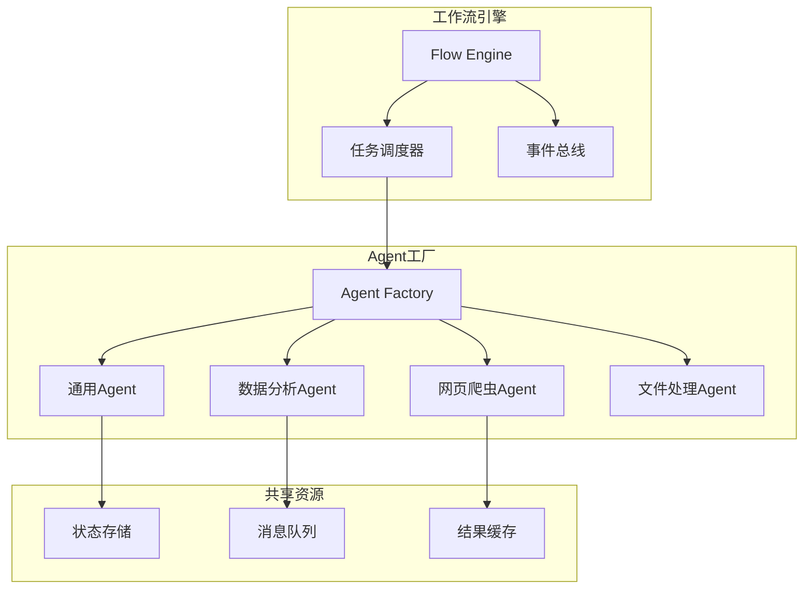
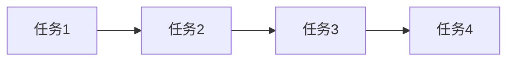
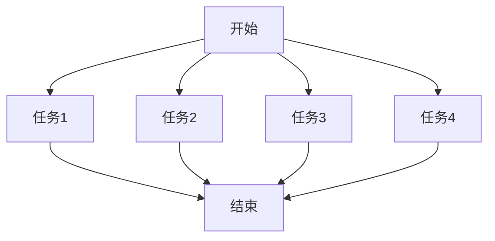
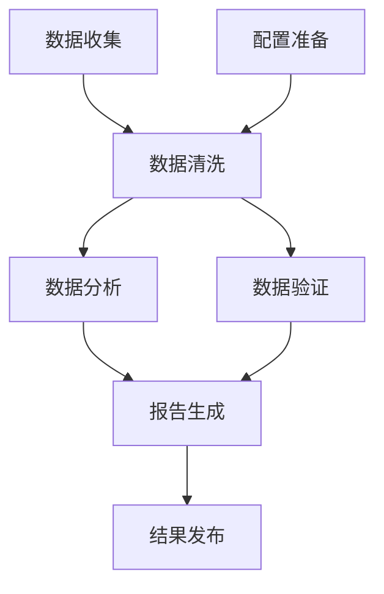

# 多Agent协作指南

本文档详细介绍 OpenManus-Go 的多Agent协作功能，包括工作流设计、任务编排和协作模式。

## 📋 目录

- [多Agent概述](#多agent概述)
- [工作流模式](#工作流模式)
- [任务编排](#任务编排)
- [Agent类型](#agent类型)
- [事件系统](#事件系统)
- [实际应用](#实际应用)
- [性能优化](#性能优化)

## 🌟 多Agent概述

### 什么是多Agent协作？

多Agent协作是指多个AI Agent通过协调工作来完成复杂任务的能力。每个Agent可以：

- 专注于特定领域的任务
- 并行或串行执行
- 共享数据和状态
- 基于依赖关系协调执行

### 协作优势

- **任务分解**：复杂任务分解为简单子任务
- **专业化**：不同Agent专注不同领域
- **并行处理**：提高整体执行效率
- **容错性**：单个Agent失败不影响整体
- **可扩展性**：易于添加新的Agent类型

### 架构图



## 🔄 工作流模式

OpenManus-Go 支持三种主要的执行模式：

### 1. Sequential（顺序执行）

任务按顺序依次执行，前一个任务完成后才开始下一个。



**适用场景**：
- 任务间有强依赖关系
- 需要严格的执行顺序
- 资源有限的环境

**使用示例**：
```bash
# 启动顺序工作流
./bin/openmanus flow --mode sequential --agents 3

# 或使用配置文件
./bin/openmanus flow --workflow examples/sequential-flow.json
```

### 2. Parallel（并行执行）

所有任务同时开始执行，充分利用并发能力。



**适用场景**：
- 任务间无依赖关系
- 需要快速完成
- 资源充足的环境

**使用示例**：
```bash
# 启动并行工作流
./bin/openmanus flow --mode parallel --agents 4

# 数据分析并行处理
./bin/openmanus flow --mode parallel --data-analysis
```

### 3. DAG（有向无环图）

基于依赖关系的智能调度，支持复杂的任务编排。



**适用场景**：
- 复杂的业务流程
- 部分任务可并行
- 需要最优执行路径

**使用示例**：
```bash
# 启动DAG工作流
./bin/openmanus flow --mode dag --workflow examples/data-pipeline.json
```

## 🎯 任务编排

### 工作流定义

#### JSON 格式定义

```json
{
  "id": "data-processing-workflow",
  "name": "数据处理工作流",
  "description": "完整的数据处理流水线",
  "mode": "dag",
  "tasks": [
    {
      "id": "collect",
      "name": "数据收集",
      "agent_type": "web_scraper",
      "goal": "从指定网站收集数据",
      "dependencies": [],
      "timeout": "5m",
      "retry_count": 3,
      "input": {
        "urls": ["https://api.example.com/data"],
        "output_file": "raw_data.json"
      }
    },
    {
      "id": "clean",
      "name": "数据清洗",
      "agent_type": "data_analysis",
      "goal": "清洗和验证收集的数据",
      "dependencies": ["collect"],
      "timeout": "10m",
      "input": {
        "input_file": "raw_data.json",
        "output_file": "clean_data.json"
      }
    },
    {
      "id": "analyze",
      "name": "数据分析",
      "agent_type": "data_analysis",
      "goal": "分析清洗后的数据，生成统计报告",
      "dependencies": ["clean"],
      "timeout": "15m",
      "input": {
        "input_file": "clean_data.json",
        "analysis_type": "statistical"
      }
    },
    {
      "id": "report",
      "name": "报告生成",
      "agent_type": "file_processor",
      "goal": "生成最终的分析报告",
      "dependencies": ["analyze"],
      "timeout": "5m",
      "input": {
        "template": "report_template.md",
        "output_format": "pdf"
      }
    }
  ],
  "global_timeout": "30m",
  "max_concurrency": 3
}
```

#### 程序化定义

```go
package main

import (
    "context"
    "openmanus-go/pkg/flow"
)

func createDataPipeline() *flow.Workflow {
    workflow := flow.NewWorkflow(
        "data-pipeline",
        "数据处理流水线",
        flow.ExecutionModeDAG,
    )
    
    // 任务1：数据收集
    collectTask := flow.NewTask(
        "collect",
        "数据收集",
        "web_scraper",
        "从多个API源收集原始数据",
    )
    collectTask.Timeout = time.Minute * 5
    collectTask.Input = map[string]any{
        "sources": []string{
            "https://api.source1.com/data",
            "https://api.source2.com/data",
        },
        "output_dir": "./raw_data",
    }
    
    // 任务2：数据清洗
    cleanTask := flow.NewTask(
        "clean",
        "数据清洗",
        "data_analysis",
        "清洗原始数据，去除无效和重复数据",
    )
    cleanTask.Dependencies = []string{"collect"}
    cleanTask.Timeout = time.Minute * 10
    cleanTask.Input = map[string]any{
        "input_dir": "./raw_data",
        "output_file": "./processed/clean_data.json",
        "validation_rules": []string{
            "remove_duplicates",
            "validate_schema",
            "normalize_format",
        },
    }
    
    // 任务3：数据分析
    analyzeTask := flow.NewTask(
        "analyze",
        "数据分析",
        "data_analysis",
        "执行统计分析和趋势识别",
    )
    analyzeTask.Dependencies = []string{"clean"}
    analyzeTask.Timeout = time.Minute * 15
    analyzeTask.Input = map[string]any{
        "input_file": "./processed/clean_data.json",
        "analysis_types": []string{
            "descriptive_statistics",
            "trend_analysis",
            "correlation_analysis",
        },
        "output_dir": "./analysis_results",
    }
    
    // 任务4：报告生成
    reportTask := flow.NewTask(
        "report",
        "报告生成",
        "file_processor",
        "生成可视化报告和摘要",
    )
    reportTask.Dependencies = []string{"analyze"}
    reportTask.Timeout = time.Minute * 5
    reportTask.Input = map[string]any{
        "analysis_dir": "./analysis_results",
        "template": "./templates/report.md",
        "output_formats": []string{"pdf", "html"},
        "output_dir": "./final_reports",
    }
    
    // 添加任务到工作流
    workflow.AddTask(collectTask)
    workflow.AddTask(cleanTask)
    workflow.AddTask(analyzeTask)
    workflow.AddTask(reportTask)
    
    return workflow
}
```

### 依赖关系管理

```go
// 复杂依赖关系示例
func createComplexWorkflow() *flow.Workflow {
    workflow := flow.NewWorkflow("complex", "复杂工作流", flow.ExecutionModeDAG)
    
    // A：无依赖，可立即执行
    taskA := flow.NewTask("A", "初始化", "general", "准备环境和配置")
    
    // B：依赖A
    taskB := flow.NewTask("B", "数据获取", "web_scraper", "获取外部数据")
    taskB.Dependencies = []string{"A"}
    
    // C：依赖A
    taskC := flow.NewTask("C", "配置验证", "general", "验证配置有效性")
    taskC.Dependencies = []string{"A"}
    
    // D：依赖B和C
    taskD := flow.NewTask("D", "数据处理", "data_analysis", "处理获取的数据")
    taskD.Dependencies = []string{"B", "C"}
    
    // E：只依赖B
    taskE := flow.NewTask("E", "数据备份", "file_processor", "备份原始数据")
    taskE.Dependencies = []string{"B"}
    
    // F：依赖D和E
    taskF := flow.NewTask("F", "最终报告", "file_processor", "生成最终报告")
    taskF.Dependencies = []string{"D", "E"}
    
    workflow.AddTask(taskA)
    workflow.AddTask(taskB)
    workflow.AddTask(taskC)
    workflow.AddTask(taskD)
    workflow.AddTask(taskE)
    workflow.AddTask(taskF)
    
    return workflow
}
```

## 🤖 Agent类型

### 内置Agent类型

#### 1. General Agent（通用）
- **用途**：通用任务处理
- **特点**：灵活性高，可处理各种类型任务
- **适用场景**：简单任务、原型开发

```go
type GeneralAgentConfig struct {
    MaxSteps    int    `json:"max_steps"`
    Temperature float64 `json:"temperature"`
    Model       string  `json:"model"`
}
```

#### 2. Data Analysis Agent（数据分析）
- **用途**：数据分析和处理
- **特点**：优化的数据处理提示词和工具集
- **适用场景**：统计分析、数据清洗、报表生成

```go
type DataAnalysisAgentConfig struct {
    MaxSteps         int      `json:"max_steps"`
    AnalysisTypes    []string `json:"analysis_types"`
    OutputFormats    []string `json:"output_formats"`
    VisualizationLib string   `json:"visualization_lib"`
}
```

#### 3. Web Scraper Agent（网页爬虫）
- **用途**：网页数据抓取
- **特点**：专门的爬虫策略和反反爬虫机制
- **适用场景**：数据收集、价格监控、内容聚合

```go
type WebScraperAgentConfig struct {
    MaxSteps      int           `json:"max_steps"`
    UserAgents    []string      `json:"user_agents"`
    RequestDelay  time.Duration `json:"request_delay"`
    MaxRetries    int           `json:"max_retries"`
    RespectRobots bool          `json:"respect_robots"`
}
```

#### 4. File Processor Agent（文件处理）
- **用途**：文件和文档处理
- **特点**：支持多种文件格式转换和处理
- **适用场景**：文档转换、批量处理、格式标准化

```go
type FileProcessorAgentConfig struct {
    MaxSteps        int      `json:"max_steps"`
    SupportedTypes  []string `json:"supported_types"`
    OutputFormats   []string `json:"output_formats"`
    CompressionLevel int     `json:"compression_level"`
}
```

### 自定义Agent类型

```go
// 创建自定义Agent类型
type CustomAgent struct {
    *agent.BaseAgent
    specialConfig *CustomConfig
}

func NewCustomAgent(config *CustomConfig) *CustomAgent {
    baseAgent := agent.NewBaseAgent(
        llmClient,
        toolRegistry,
        stateStore,
    )
    
    return &CustomAgent{
        BaseAgent:     baseAgent,
        specialConfig: config,
    }
}

func (a *CustomAgent) Plan(ctx context.Context, goal string, trace *state.Trace) (*state.Action, error) {
    // 自定义规划逻辑
    // 可以根据特定领域知识调整规划策略
    return a.customPlan(ctx, goal, trace)
}

// 注册自定义Agent类型
func (f *AgentFactory) CreateAgent(agentType string, config map[string]interface{}) (agent.Agent, error) {
    switch agentType {
    case "custom_agent":
        return f.createCustomAgent(config)
    case "ml_specialist":
        return f.createMLSpecialistAgent(config)
    default:
        return f.createGeneralAgent(config)
    }
}
```

## 📡 事件系统

### 事件类型

```go
type EventType string

const (
    EventFlowStarted    EventType = "flow_started"
    EventFlowCompleted  EventType = "flow_completed"
    EventFlowFailed     EventType = "flow_failed"
    EventTaskStarted    EventType = "task_started"
    EventTaskCompleted  EventType = "task_completed"
    EventTaskFailed     EventType = "task_failed"
    EventTaskSkipped    EventType = "task_skipped"
    EventAgentCreated   EventType = "agent_created"
    EventAgentDestroyed EventType = "agent_destroyed"
)

type Event struct {
    ID          string                 `json:"id"`
    Type        EventType              `json:"type"`
    Timestamp   time.Time              `json:"timestamp"`
    WorkflowID  string                 `json:"workflow_id"`
    TaskID      string                 `json:"task_id,omitempty"`
    AgentID     string                 `json:"agent_id,omitempty"`
    Message     string                 `json:"message"`
    Data        map[string]interface{} `json:"data,omitempty"`
    Error       string                 `json:"error,omitempty"`
}
```

### 事件监听

```go
// 监听工作流事件
func monitorWorkflow(engine *flow.Engine, workflowID string) {
    eventChan, unsubscribe := engine.Subscribe(workflowID)
    defer unsubscribe()
    
    for event := range eventChan {
        switch event.Type {
        case flow.EventFlowStarted:
            log.Printf("🚀 工作流开始: %s", event.Message)
            
        case flow.EventTaskStarted:
            log.Printf("🔄 任务开始: %s (ID: %s)", event.Message, event.TaskID)
            
        case flow.EventTaskCompleted:
            duration := event.Data["duration"].(time.Duration)
            log.Printf("✅ 任务完成: %s (耗时: %v)", event.Message, duration)
            
        case flow.EventTaskFailed:
            log.Printf("❌ 任务失败: %s (错误: %s)", event.Message, event.Error)
            
        case flow.EventFlowCompleted:
            totalDuration := event.Data["total_duration"].(time.Duration)
            log.Printf("🎉 工作流完成: %s (总耗时: %v)", event.Message, totalDuration)
            
        case flow.EventFlowFailed:
            log.Printf("💥 工作流失败: %s (错误: %s)", event.Message, event.Error)
        }
    }
}
```

### 事件处理器

```go
// 自定义事件处理器
type WorkflowEventHandler struct {
    notifier *NotificationService
    metrics  *MetricsCollector
}

func (h *WorkflowEventHandler) HandleEvent(event *flow.Event) {
    // 记录指标
    h.metrics.RecordEvent(event)
    
    // 发送通知
    switch event.Type {
    case flow.EventFlowCompleted:
        h.notifier.SendSuccess(event.WorkflowID, event.Message)
    case flow.EventFlowFailed:
        h.notifier.SendAlert(event.WorkflowID, event.Error)
    case flow.EventTaskFailed:
        h.notifier.SendWarning(event.TaskID, event.Error)
    }
    
    // 自动恢复策略
    if event.Type == flow.EventTaskFailed {
        h.handleTaskFailure(event)
    }
}

func (h *WorkflowEventHandler) handleTaskFailure(event *flow.Event) {
    taskConfig := h.getTaskConfig(event.TaskID)
    
    if taskConfig.AutoRetry && taskConfig.RetryCount < taskConfig.MaxRetries {
        // 自动重试失败的任务
        h.retryTask(event.TaskID)
    }
}
```

## 🔧 实际应用

### 示例1：电商数据分析流水线

```go
func createEcommerceAnalysisPipeline() *flow.Workflow {
    workflow := flow.NewWorkflow(
        "ecommerce-analysis",
        "电商数据分析流水线",
        flow.ExecutionModeDAG,
    )
    
    // 1. 数据收集（并行）
    salesDataTask := flow.NewTask("sales-data", "销售数据收集", "web_scraper",
        "从销售系统API收集交易数据")
    salesDataTask.Input = map[string]any{
        "api_endpoint": "https://sales-api.company.com/transactions",
        "date_range": "last_30_days",
    }
    
    userDataTask := flow.NewTask("user-data", "用户数据收集", "web_scraper",
        "从用户管理系统收集用户行为数据")
    userDataTask.Input = map[string]any{
        "api_endpoint": "https://user-api.company.com/behaviors",
        "date_range": "last_30_days",
    }
    
    productDataTask := flow.NewTask("product-data", "产品数据收集", "web_scraper",
        "从产品目录系统收集产品信息")
    productDataTask.Input = map[string]any{
        "api_endpoint": "https://catalog-api.company.com/products",
    }
    
    // 2. 数据整合
    dataIntegrationTask := flow.NewTask("integration", "数据整合", "data_analysis",
        "整合来自不同源的数据，建立关联关系")
    dataIntegrationTask.Dependencies = []string{"sales-data", "user-data", "product-data"}
    dataIntegrationTask.Input = map[string]any{
        "join_keys": []string{"user_id", "product_id"},
        "output_format": "parquet",
    }
    
    // 3. 数据分析（并行）
    salesAnalysisTask := flow.NewTask("sales-analysis", "销售分析", "data_analysis",
        "分析销售趋势和模式")
    salesAnalysisTask.Dependencies = []string{"integration"}
    
    userAnalysisTask := flow.NewTask("user-analysis", "用户分析", "data_analysis",
        "分析用户行为和偏好")
    userAnalysisTask.Dependencies = []string{"integration"}
    
    productAnalysisTask := flow.NewTask("product-analysis", "产品分析", "data_analysis",
        "分析产品性能和热度")
    productAnalysisTask.Dependencies = []string{"integration"}
    
    // 4. 报告生成
    reportTask := flow.NewTask("report", "综合报告生成", "file_processor",
        "生成综合分析报告和可视化仪表板")
    reportTask.Dependencies = []string{"sales-analysis", "user-analysis", "product-analysis"}
    reportTask.Input = map[string]any{
        "template": "ecommerce_report_template.html",
        "output_formats": []string{"pdf", "html"},
        "include_charts": true,
    }
    
    // 5. 结果分发
    distributionTask := flow.NewTask("distribution", "结果分发", "general",
        "将报告发送给相关团队")
    distributionTask.Dependencies = []string{"report"}
    distributionTask.Input = map[string]any{
        "recipients": []string{
            "sales-team@company.com",
            "marketing-team@company.com",
            "product-team@company.com",
        },
        "notification_channels": []string{"email", "slack"},
    }
    
    workflow.AddTask(salesDataTask)
    workflow.AddTask(userDataTask)
    workflow.AddTask(productDataTask)
    workflow.AddTask(dataIntegrationTask)
    workflow.AddTask(salesAnalysisTask)
    workflow.AddTask(userAnalysisTask)
    workflow.AddTask(productAnalysisTask)
    workflow.AddTask(reportTask)
    workflow.AddTask(distributionTask)
    
    return workflow
}
```

### 示例2：内容管理系统

```bash
# 启动内容管理工作流
./bin/openmanus flow --workflow examples/content-management.json
```

`content-management.json`:
```json
{
  "id": "content-management",
  "name": "内容管理工作流",
  "mode": "dag",
  "tasks": [
    {
      "id": "content-scan",
      "name": "内容扫描",
      "agent_type": "file_processor",
      "goal": "扫描content目录，识别新增和修改的文件",
      "dependencies": [],
      "input": {
        "scan_directory": "./content",
        "file_types": ["*.md", "*.html", "*.txt"],
        "since": "last_run"
      }
    },
    {
      "id": "content-analysis",
      "name": "内容分析",
      "agent_type": "data_analysis",
      "goal": "分析内容质量、关键词和SEO指标",
      "dependencies": ["content-scan"],
      "input": {
        "analysis_types": ["readability", "seo", "sentiment"],
        "language": "zh-CN"
      }
    },
    {
      "id": "image-optimization",
      "name": "图片优化",
      "agent_type": "file_processor",
      "goal": "优化图片大小和格式",
      "dependencies": ["content-scan"],
      "input": {
        "image_quality": 85,
        "formats": ["webp", "jpg"],
        "max_width": 1920
      }
    },
    {
      "id": "static-generation",
      "name": "静态文件生成",
      "agent_type": "file_processor",
      "goal": "生成静态网站文件",
      "dependencies": ["content-analysis", "image-optimization"],
      "input": {
        "template_engine": "hugo",
        "output_directory": "./public",
        "minify": true
      }
    },
    {
      "id": "deployment",
      "name": "部署发布",
      "agent_type": "general",
      "goal": "将生成的文件部署到CDN",
      "dependencies": ["static-generation"],
      "input": {
        "cdn_provider": "cloudflare",
        "cache_invalidation": true
      }
    }
  ]
}
```

### 示例3：系统监控和维护

```go
func createSystemMaintenanceWorkflow() *flow.Workflow {
    workflow := flow.NewWorkflow(
        "system-maintenance",
        "系统维护工作流",
        flow.ExecutionModeSequential, // 维护任务需要顺序执行
    )
    
    // 1. 系统健康检查
    healthCheckTask := flow.NewTask("health-check", "系统健康检查", "general",
        "检查系统各组件的运行状态")
    healthCheckTask.Input = map[string]any{
        "services": []string{"nginx", "redis", "mysql", "app"},
        "check_disk_space": true,
        "check_memory_usage": true,
        "check_cpu_load": true,
    }
    
    // 2. 日志清理
    logCleanupTask := flow.NewTask("log-cleanup", "日志清理", "file_processor",
        "清理过期的日志文件")
    logCleanupTask.Dependencies = []string{"health-check"}
    logCleanupTask.Input = map[string]any{
        "log_directories": []string{"/var/log", "./logs"},
        "retention_days": 30,
        "compress_old_logs": true,
    }
    
    // 3. 数据库维护
    dbMaintenanceTask := flow.NewTask("db-maintenance", "数据库维护", "data_analysis",
        "执行数据库优化和清理")
    dbMaintenanceTask.Dependencies = []string{"log-cleanup"}
    dbMaintenanceTask.Input = map[string]any{
        "operations": []string{
            "analyze_tables",
            "optimize_tables",
            "clean_temp_data",
        },
        "databases": []string{"main", "analytics"},
    }
    
    // 4. 备份检查
    backupCheckTask := flow.NewTask("backup-check", "备份检查", "general",
        "验证备份文件的完整性")
    backupCheckTask.Dependencies = []string{"db-maintenance"}
    backupCheckTask.Input = map[string]any{
        "backup_locations": []string{"/backup", "s3://backup-bucket"},
        "verify_integrity": true,
        "test_restore": false, // 在测试环境中可以设为true
    }
    
    // 5. 维护报告
    reportTask := flow.NewTask("maintenance-report", "维护报告", "file_processor",
        "生成系统维护报告")
    reportTask.Dependencies = []string{"backup-check"}
    reportTask.Input = map[string]any{
        "report_template": "maintenance_report.md",
        "include_metrics": true,
        "send_email": true,
        "recipients": ["admin@company.com"],
    }
    
    workflow.AddTask(healthCheckTask)
    workflow.AddTask(logCleanupTask)
    workflow.AddTask(dbMaintenanceTask)
    workflow.AddTask(backupCheckTask)
    workflow.AddTask(reportTask)
    
    return workflow
}
```

## ⚡ 性能优化

### 并发控制

```go
// 配置最大并发数
type FlowEngineConfig struct {
    MaxConcurrency   int           `json:"max_concurrency"`
    WorkerPoolSize   int           `json:"worker_pool_size"`
    TaskTimeout      time.Duration `json:"task_timeout"`
    QueueSize        int           `json:"queue_size"`
    ResourceLimits   ResourceLimits `json:"resource_limits"`
}

type ResourceLimits struct {
    MaxMemoryPerAgent string `json:"max_memory_per_agent"`
    MaxCPUPerAgent    string `json:"max_cpu_per_agent"`
    MaxDiskSpace      string `json:"max_disk_space"`
}
```

### 资源池管理

```go
// Agent资源池
type AgentPool struct {
    agents   map[string][]agent.Agent
    mutex    sync.RWMutex
    maxSize  int
    factory  *AgentFactory
}

func (p *AgentPool) GetAgent(agentType string) agent.Agent {
    p.mutex.Lock()
    defer p.mutex.Unlock()
    
    agents := p.agents[agentType]
    if len(agents) > 0 {
        // 复用现有Agent
        agent := agents[len(agents)-1]
        p.agents[agentType] = agents[:len(agents)-1]
        return agent
    }
    
    // 创建新Agent
    return p.factory.CreateAgent(agentType, nil)
}

func (p *AgentPool) ReturnAgent(agentType string, agent agent.Agent) {
    p.mutex.Lock()
    defer p.mutex.Unlock()
    
    agents := p.agents[agentType]
    if len(agents) < p.maxSize {
        p.agents[agentType] = append(agents, agent)
    } else {
        // 池已满，销毁Agent
        agent.Stop()
    }
}
```

### 缓存策略

```go
// 结果缓存
type ResultCache struct {
    cache  map[string]CacheEntry
    mutex  sync.RWMutex
    maxAge time.Duration
}

type CacheEntry struct {
    Result    interface{}
    Timestamp time.Time
    Hash      string
}

func (c *ResultCache) Get(taskID string, inputHash string) (interface{}, bool) {
    c.mutex.RLock()
    defer c.mutex.RUnlock()
    
    entry, exists := c.cache[taskID]
    if !exists {
        return nil, false
    }
    
    // 检查缓存是否过期
    if time.Since(entry.Timestamp) > c.maxAge {
        delete(c.cache, taskID)
        return nil, false
    }
    
    // 检查输入是否相同
    if entry.Hash != inputHash {
        return nil, false
    }
    
    return entry.Result, true
}
```

### 监控和指标

```go
// 工作流指标
type WorkflowMetrics struct {
    TotalExecutions    int64         `json:"total_executions"`
    SuccessfulRuns     int64         `json:"successful_runs"`
    FailedRuns         int64         `json:"failed_runs"`
    AverageExecutionTime time.Duration `json:"average_execution_time"`
    TaskMetrics        map[string]TaskMetric `json:"task_metrics"`
}

type TaskMetric struct {
    ExecutionCount   int64         `json:"execution_count"`
    SuccessRate      float64       `json:"success_rate"`
    AverageTime      time.Duration `json:"average_time"`
    ErrorTypes       map[string]int `json:"error_types"`
}

// 收集指标
func (e *FlowEngine) collectMetrics(execution *WorkflowExecution) {
    e.metrics.TotalExecutions++
    
    if execution.Status == StatusCompleted {
        e.metrics.SuccessfulRuns++
    } else {
        e.metrics.FailedRuns++
    }
    
    duration := execution.EndTime.Sub(execution.StartTime)
    e.updateAverageExecutionTime(duration)
    
    // 更新任务指标
    for _, taskResult := range execution.TaskResults {
        e.updateTaskMetrics(taskResult)
    }
}
```

### 最佳实践

1. **合理设置并发数**：
   - 根据系统资源调整`max_concurrency`
   - 监控CPU和内存使用率
   - 避免过度并发导致资源竞争

2. **优化任务依赖**：
   - 最小化不必要的依赖关系
   - 将独立任务设为并行执行
   - 使用DAG模式获得最优执行路径

3. **错误处理策略**：
   - 设置合理的重试次数和间隔
   - 实现优雅降级机制
   - 记录详细的错误信息用于调试

4. **资源管理**：
   - 使用Agent池减少创建开销
   - 实现结果缓存提高效率
   - 设置超时避免无限等待

5. **监控和告警**：
   - 监控工作流执行状态
   - 设置关键指标告警
   - 定期分析性能瓶颈

---

通过多Agent协作，OpenManus-Go 可以处理复杂的业务流程，提供强大的任务编排和协调能力。合理的设计和优化可以大大提高系统的效率和可靠性！

**相关文档**: [核心概念](CONCEPTS.md) → [使用示例](EXAMPLES.md) → [性能优化](PERFORMANCE.md)
