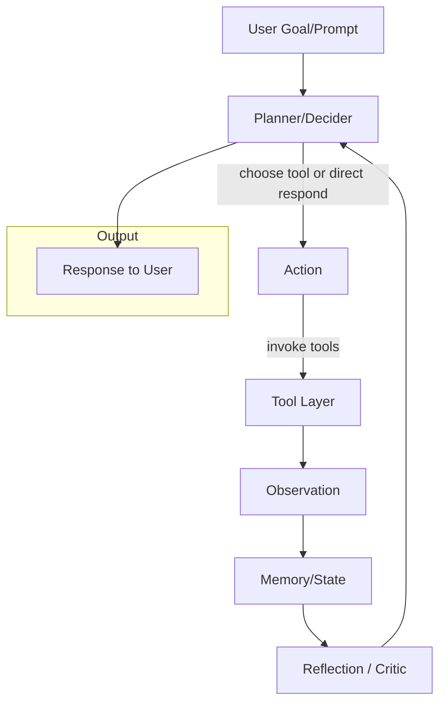
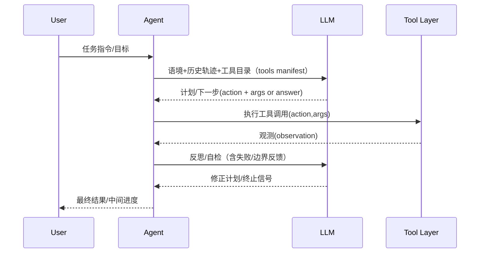

# openmanus-go

# OpenManus 实现原理与思路（以及 Go 语言重写指南）

> 目标：这份文档用于快速把握 OpenManus 的核心设计、运行机制与代码组织方式，并给出一套 Golang 版本实现蓝图，可直接交给 Cursor/Copilot 作为实现提示（prompt + 规格文档）。
> 

---

## 1. 项目定位

- **OpenManus**：一个开源的通用 AI Agent 框架，强调**简单可用**、**易扩展**和**开放工具生态**。
- 典型能力：基于自然语言输入进行**计划（Plan）→ 工具调用（Tool Use）→ 观测（Observation）→ 反思（Reflection）→ 再决策（Next Action）**的闭环；支持**MCP（Model Context Protocol）**工具模式与**多 Agent（实验性）**流程；提供数据分析类 Agent 的扩展示例。

---

## 2. 运行机制（高层视图）



- **Planner/Decider**：把用户目标拆分为可执行步骤；决定“直接回答”还是“调用工具/子任务/子 Agent”。
- **Tool Layer**：统一的工具协议（名称、参数、描述、输入输出 JSON）；工具调用通常经过“参数构造 → 执行 → 结果摘要”。
- **Observation**：对工具返回进行结构化记录，供后续思考与上下文注入。
- **Reflection**：基于当前轨迹（steps/observations）做自检与修正（如：是否需要重试、是否需要换工具、是否已经完成）。
- **Memory/State**：短期对话态（本轮上下文、草稿计划、已尝试步骤）+ 可选的长期记忆（事实表、知识库、向量检索等）。

通用的控制回路：

1. 读取用户意图 & 当前状态；
2. 规划下一步（“回答/工具/子 Agent/停止”四选一）；
3. 若选择工具，则参数化并执行；
4. 吸收观测、反思、收敛；
5. 直到“完成/放弃/达到步数/达到预算”。

---

## 3. 代码组织（参考原项目常见结构）

> 说明：原仓库以 Python 为主，包含：
> 
- `config/`：`config.example.toml` & 用户自定义 `config.toml`，配置 LLM（模型、base_url、api_key、max_tokens、temperature 等）、可选的 `runflow` 开关（例如 `use_data_analysis_agent`）。
- 顶层入口：`main.py`（单 Agent 交互式）、`run_mcp.py`（MCP 工具模式）、`run_flow.py`（实验性多 Agent / 流式编排）。
- `app/`、`examples/`、`workspace/`、`protocol/a2a/`、`tests/` 等目录作为扩展点或演示样例。
- 依赖：`requirements.txt`；可选浏览器自动化 `playwright install`。

---

## 4. 核心概念与组件

### 4.1 Agent

- **统一接口**：`plan()`、`act()`、`reflect()`、`should_stop()`；
- **内置角色**：
    - **General Agent**：默认泛化智能体；
    - **DataAnalysis Agent**：示例扩展（面向数据分析/可视化），通过配置开启；
    - **Multi-Agent Flow**（实验性）：在 `run_flow` 中通过配置与编排调用多个 Agent 形成流水线或协作。

### 4.2 Tool System（工具系统）

- **Schema**：`name`、`description`、`input_schema`、`output_schema`；
- **调用策略**：模型先“选工具→填参数→执行→摘要结果”；
- **常见工具类**：
    - Web/Browser（如 Playwright/Browser-use）
    - 文件/知识检索（本地/向量库）
    - 数据分析/可视化（DataFrame + Chart）
    - 系统/环境工具（Shell/FS/Process）
    - MCP 工具（通过 MCP Server 暴露跨进程/跨语言工具）

### 4.3 Planner / Controller

- 维持“当前目标、子任务队列、步骤计数、失败重试次数、预算/时间上限”等控制变量；
- 依据“反思器”的反馈动态调整策略（例如：切换工具、缩小问题范围、回滚到上一步、请求用户澄清）。

### 4.4 Memory / State

- **短期**：本轮对话上下文、已执行步骤、关键中间结论（可结构化，以便压缩/回放）；
- **长期（可选）**：向量检索（FAISS/Weaviate/ES-Vector）、KV（Redis）、对象存储（S3）等；
- **压缩策略**：定期对历史 Observation 做摘要，防止上下文爆炸。

### 4.5 MCP（Model Context Protocol）

- 通过 MCP 实现“**模型 ↔︎ 工具/服务**”的标准化通信；
- 统一声明工具、参数与结果；
- 便于与 IDE/编辑器、外部微服务、数据系统集成。

---

## 5. 交互流程（单 Agent）



---

## 6. 错误恢复与安全

- **限制项**：最大步数、最大 token、时间/成本预算；
- **重试**：工具调用失败的退避策略（固定/指数）、参数修正再试；
- **审计**：保存 `steps/observations/decisions` 轨迹，便于回放与测试；
- **边界**：对“文件系统/网络请求/执行命令”等敏感工具进行沙箱与白名单；
- **确定性**：关键路径温度尽量低，重要工具调用要求结构化输出校验。

---

## 7. Go 语言版本设计蓝图

### 7.1 模块划分

```
openmanus-go/
├── cmd/                        # 各个可执行程序的入口
│   └── openmanus/              # 主 CLI 程序（cobra）
│       └── main.go
│
├── pkg/                        # 可被外部项目导入的库
│   ├── agent/                  # Agent 核心逻辑
│   │   ├── core.go             # Agent 接口与控制循环
│   │   ├── planner.go          # 规划器
│   │   ├── memory.go           # 短期/长期记忆
│   │   └── reflection.go       # 反思机制
│   │
│   ├── tool/                   # 工具系统
│   │   ├── registry.go         # 工具注册表
│   │   ├── schema.go           # 工具输入/输出 Schema
│   │   ├── exec.go             # 工具调用逻辑
│   │   └── builtin/            # 内置工具（http/fs/redis/...）
│   │
│   ├── llm/                    # LLM 抽象与客户端
│   │   ├── client.go
│   │   ├── openai.go
│   │   └── anthropic.go
│   │
│   ├── mcp/                    # Model Context Protocol
│   │   ├── client.go
│   │   └── server.go
│   │
│   ├── flow/                   # 多 Agent 协作
│   │   └── pipeline.go
│   │
│   ├── config/                 # 配置加载
│   │   └── config.go
│   │
│   ├── state/                  # 运行轨迹与持久化
│   │   ├── types.go
│   │   └── store.go
│   │
│   └── log/                    # 日志封装
│       └── logger.go
│
├── internal/                   # 私有应用逻辑（不可导入）
│   └── prompts/                # 系统提示词模板
│       ├── system.txt
│       └── reflection.txt
│
├── api/                        # 若未来要提供 gRPC/REST API，可以放这里
│
├── deployments/                # 部署配置（Dockerfile, K8s yaml, helm 等）
│   ├── docker/
│   │   └── Dockerfile
│   └── docker-compose.yaml
│
├── scripts/                    # 脚本（make, test, build）
│   └── test.sh
│
├── configs/                    # 配置文件模板
│   └── config.example.toml
│
├── examples/                   # 使用示例
│   ├── single_agent/
│   ├── data_analysis/
│   └── multi_agent/
│
├── test/                       # 额外的测试数据与集成测试
│   └── replay/
│
├── docs/                       # 文档
│   ├── ARCHITECTURE.md
│   ├── TOOLS.md
│   └── PROMPTS.md
│
├── go.mod
├── go.sum
└── Makefile
## ✅ 特别说明（贴合 OpenManus 特性）

- `pkg/agent` → 实现 **Plan → Tool Use → Observation → Reflection → Next** 的核心回路。
- `pkg/tool/builtin` → 放置官方内置工具（http、fs、redis、mysql、es、s3、crawler、cron）。
- `pkg/mcp` → 保持与 MCP 协议兼容，方便跨进程工具集成。
- `internal/prompts` → 放置系统提示词模板，不对外暴露。
- `examples/` → 提供快速上手的 demo（单 Agent、数据分析 Agent、多 Agent 流程）。
- `deployments/` → 支持 docker-compose 一键启动依赖（redis/mysql/es/s3 mock）。
```

### 7.2 关键接口（示例）

```go
// pkg/state/types.gopackage state
type Action struct {    Name   string            `json:"name"`    Args   map[string]any    `json:"args"`    Reason string            `json:"reason,omitempty"`}type Observation struct {    Tool    string         `json:"tool"`    Output  map[string]any `json:"output"`    ErrMsg  string         `json:"err_msg,omitempty"`    Latency int64          `json:"latency_ms"`}type Step struct {    Index       int            `json:"index"`    Action      Action         `json:"action"`    Observation *Observation   `json:"observation,omitempty"`    Summary     string         `json:"summary,omitempty"`}// pkg/agent/core.gopackage agent
type Agent interface {    Plan(ctx context.Context, goal string, trace *Trace) (state.Action, error)    Act(ctx context.Context, a state.Action) (*state.Observation, error)    Reflect(ctx context.Context, trace *Trace) error    ShouldStop(trace *Trace) bool    Loop(ctx context.Context, goal string) (string, error)}
```

### 7.3 LLM 抽象与工具选择

- 支持 **Tool Choice**（由模型返回 `function_call`/`tool_calls` 或 JSON）；
- **安全解析**：对模型生成的参数进行 JSON Schema 校验；
- **思维链隐藏**：生产环境只存“可解释轨迹”，避免泄露敏感中间推理。

### 7.4 工具系统（Go）

```go
// pkg/tool/schema.gopackage tool
type Tool interface {    Name() string    Desc() string    InputSchema() map[string]any    OutputSchema() map[string]any    Invoke(ctx context.Context, args map[string]any) (map[string]any, error)}// pkg/tool/registry.govar DefaultRegistry = New()type Registry struct { m map[string]Tool; mu sync.RWMutex }
```

- **内置工具建议**：
    - `http`（net/http + retry）
    - `browser`（rod/chromedp，可选）
    - `fs` / `shell`（沙箱、黑白名单）
    - `redis`、`mysql`、`postgres`、`kafka`、`elasticsearch`、`s3`、`kv（badger/pebble）`
    - `crawler`（colly）、`cron`（robfig/cron）
    - `viz`（数据可视化：生成图表文件/HTML）

### 7.5 计划器与反思器

- **Planner**：有限状态机或策略机（如：`DECIDE_TOOL | DIRECT_ANSWER | ASK_CLARIFICATION | STOP`）。
- **Reflection**：
    - 质量自评：是否满足目标？是否重复？是否遗漏关键子任务？
    - 失败处理：参数修正、工具替换、回滚上一步；
    - 终止条件：最大步数 / 无增益 / 用户中断。

### 7.6 记忆与轨迹

- **短期**：`Trace{Goal, Steps[], Scratch, Budget}`；
- **持久化**：`jsonl`、`sqlite` 或 `s3://bucket/run-<ts>.jsonl`；
- **长期**（可选）：向量库（`weaviate`/`qdrant`/`milvus`）+ 检索工具。

### 7.7 配置与启动

- `viper` 读取 `config.toml`：
    - `[llm] model/base_url/api_key/max_tokens/temperature`
    - `[runflow] use_data_analysis_agent = true|false`
- CLI：
    - `openmanus run`（单 Agent）
    - `openmanus mcp`（启动 MCP Server）
    - `openmanus flow`（多 Agent 管线）

### 7.8 并发与性能

- 工具调用采用 `errgroup` + `context` 管控超时与取消；
- 对 LLM 流式响应与工具并行（如并行预检/抓取）做统一调度；
- Prompt 模板缓存与结果缓存（`ristretto`）。

### 7.9 测试与可观测性

- **回放测试**：基于已存轨迹做离线回放；
- **端到端**：以固定 prompt 与 mock 工具验证决策；
- **日志/指标**：zap + Prometheus 指标（step_latency、tool_failures、tokens_used）。

---

## 8. 提示词与协议（可直接用于实现）

### 8.1 系统提示（简版）

```
You are OpenManus-Go, a generalist agent. Maintain a loop of {Plan -> (Direct Answer | Tool Use) -> Observe -> Reflect -> Decide Next}.
Follow the tool registry strictly. When using tools, ALWAYS return JSON args adhering to the tool's input_schema.
Stop when the user goal is satisfied or no more useful action can be taken.
```

### 8.2 Tool 选择提示（片段）

```
TOOLS CATALOG (name, description, input_schema):
{{tool_manifest}}

Given the GOAL and CONTEXT, choose either:
- DIRECT_ANSWER: <text>
- USE_TOOL: {"name": <tool_name>, "args": <json-args>}
- ASK_CLARIFICATION: <question>
- STOP: <why>
Return JSON only.
```

### 8.3 反思提示（片段）

```
Given the recent steps and observations, evaluate:
1) Are we closer to the goal? 2) What is missing? 3) Any safer/faster tool or plan?
Return JSON: {"revise_plan": <bool>, "next_action_hint": <text>, "should_stop": <bool>, "reason": <text>}
```

---

## 9. 与原版的一致性与差异控制

- **一致性**：
    - 同名工具/相似参数；
    - 相同的回路（Plan→Tool→Obs→Reflect）；
    - 支持 MCP、支持 DataAnalysis Agent 的开关式启用。
- **差异**：
    - Go 的并发/内存模型（channel/errgroup）；
    - 更严格的类型与 JSON Schema 校验；
    - 工具沙箱与权限细粒度更强（适合生产）。

---

## 10. 里程碑（实现路线）

1. **MVP（1-2 天）**：单 Agent + OpenAI 兼容 LLM 客户端 + `http/fs` 两个工具 + 基本回路（最多 8 步）+ JSON 轨迹持久化；
2. **工具扩展（3-5 天）**：`browser`、`redis`、`mysql/postgres`、`s3`、`es`、`crawler`、`cron`、`kv`；
3. **MCP（2 天）**：接入 MCP 客户端与 server demo；
4. **DataAnalysis Agent（2 天）**：表格 → ECharts/Plot 导出图像；
5. **多 Agent Flow（3 天）**：Linear/DAG 编排；
6. **质量与性能（持续）**：回放测试、指标、缓存、控制台 UI。

---

## 11. 交付清单（给 Cursor 的指令）

- 基于本文件创建 `openmanus-go` 项目骨架与模块；
- 实现 `Agent` 接口、`Tool` 注册与调用、`LLM` 抽象与 OpenAI 兼容实现；
- 完成 CLI（`run/mcp/flow` 子命令）；
- 提供最少 6 个内置工具（`http/fs/redis/mysql/browser/crawler`）；
- 写 3 个 e2e 示例（搜索→抓取→总结；数据下载→分析→图表；多 Agent 协作 demo）；
- 输出 `docs/ARCHITECTURE.md`、`docs/TOOLS.md`、`docs/PROMPTS.md` 与 `examples/`；
- 附带 `docker/Dockerfile` 与 `docker-compose.yaml`（含可选依赖如 redis、mysql、es、s3 mock）。

---

## 12. 额外建议

- 关键路径温度设为 0 或接近 0；
- 对工具调用返回做强校验与截断（避免把长结果原样丢回 LLM）；
- 对浏览器/爬虫加 robots 与域名白名单；
- 预留 RL（如 GRPO）训练数据导出格式（step-level trajectory），为后续策略优化做准备。

---

**本文件可直接投喂给 Cursor 作为“规格+骨架生成”提示。**