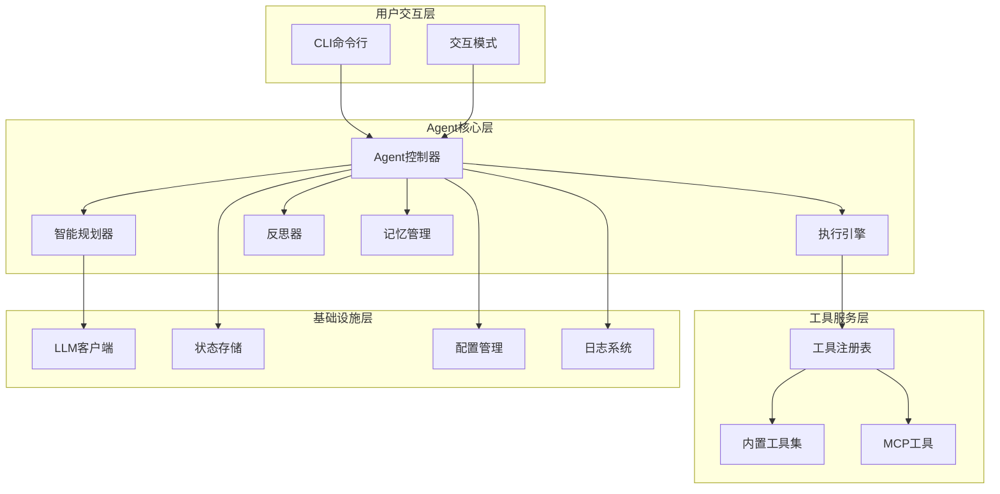
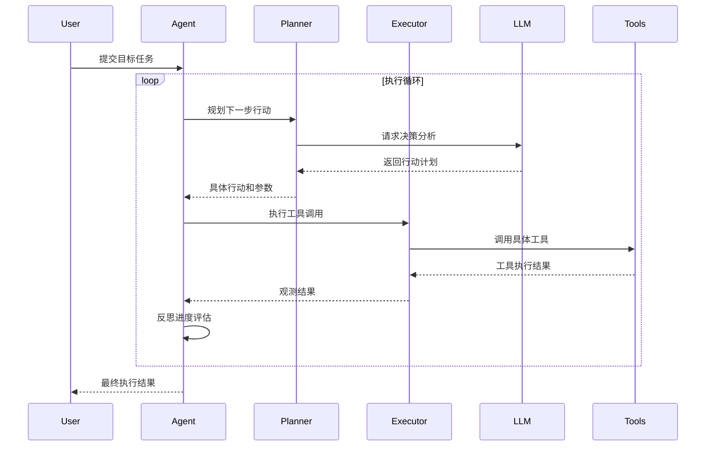
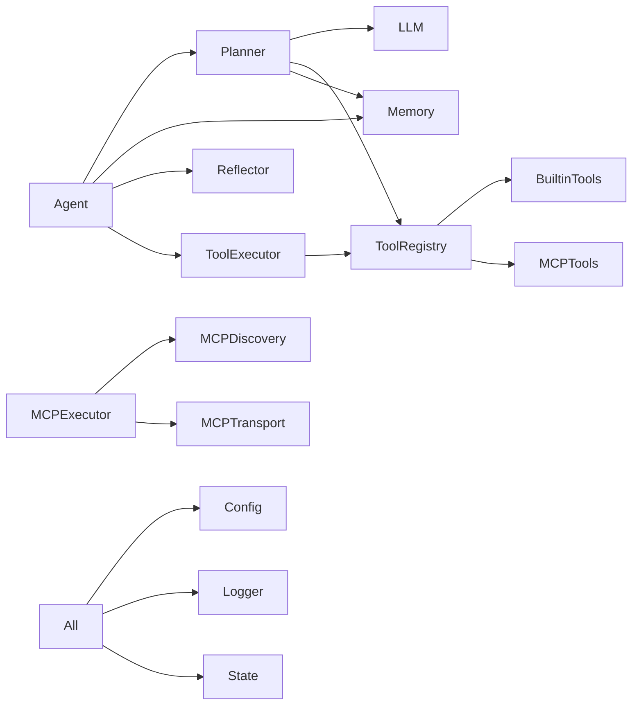

# OpenManus-Go 项目架构分析报告

## 📊 项目概述

**OpenManus-Go** 是一个基于 Go 语言开发的通用 AI Agent 框架，采用现代化的架构设计，实现了 **Plan → Tool Use → Observation → Reflection** 的智能执行循环。该项目具有高度的模块化、可扩展性和企业级特性。

### 🎯 核心特性
- 智能 Agent 架构：自动规划、工具调用、实时观测、反思机制
- MCP (Model Context Protocol) 集成：标准化的工具接口和外部服务集成
- 丰富的内置工具生态：文件系统、网络请求、数据库操作、浏览器自动化
- 企业级特性：配置管理、日志系统、状态追踪、容器化部署

## 🏗️ 系统架构

### 总体架构图



### 核心执行流程



## 📁 项目结构分析

### 目录组织
```
openmanus-go/
├── cmd/openmanus/          # CLI 应用入口
│   ├── main.go            # 主程序入口
│   └── commands/          # 命令行命令实现
├── pkg/                   # 核心库
│   ├── agent/            # Agent 实现
│   ├── tool/             # 工具系统
│   ├── llm/              # LLM 客户端
│   ├── config/           # 配置管理
│   ├── state/            # 状态管理
│   └── mcp/              # MCP 协议
├── configs/              # 配置文件
├── examples/             # 使用示例
├── deployments/          # 部署配置
└── docs/                 # 文档
```

### 模块依赖关系


## 🔧 核心组件深度分析

### 1. Agent 层 - 智能控制核心

#### BaseAgent
**作用**：协调整个执行循环的核心控制器

**核心特性**：
- 统一线性执行策略，类似 OpenManus 的设计理念
- 智能预算管理（步数、Token、时间限制）
- 详细的执行日志和进度追踪
- 自动轨迹压缩和内存优化

**关键方法**：
- [`Loop()`](openmanus-go/pkg/agent/core.go:269)：完整的执行循环
- [`Plan()`](openmanus-go/pkg/agent/core.go:224)：规划下一步动作
- [`Act()`](openmanus-go/pkg/agent/core.go:229)：执行动作
- [`Reflect()`](openmanus-go/pkg/agent/core.go:236)：反思分析

#### Planner - 智能规划器
**作用**：基于目标和轨迹进行智能决策

**核心特性**：
- 使用 LLM 进行智能规划
- 统一工具选择策略（内置工具 + MCP工具）
- 基于记忆的上下文增强
- 智能的失败模式分析

**规划策略**：
```go
// 系统提示优先级
1. 数据分析优先：如果已有数据，优先分析是否足够回答问题
2. 工具选择：基于功能而非类型选择最适合的工具
3. 错误处理：学习失败模式，避免重复错误
4. 停止条件：智能判断任务完成度
```

### 2. 工具系统 - 可扩展的执行引擎

#### 统一工具架构
```go
type Tool interface {
    Name() string
    Description() string
    InputSchema() map[string]any
    OutputSchema() map[string]any
    Invoke(ctx context.Context, args map[string]any) (map[string]any, error)
}
```

#### 内置工具生态
| 工具类型 | 工具名称 | 主要功能 | 配置要求 |
|----------|----------|----------|----------|
| **网络通信** | [`http`](pkg/tool/builtin/http.go) | HTTP 请求、API 调用 | 域名白名单 |
| **文件系统** | [`fs`](pkg/tool/builtin/fs.go) | 文件读写、目录操作 | 路径权限控制 |
| **数据库** | [`redis`](pkg/tool/builtin/redis.go)/[`mysql`](pkg/tool/builtin/mysql.go) | 数据存储和查询 | 连接配置 |
| **浏览器自动化** | [`browser`](pkg/tool/builtin/browser.go) | 页面操作、截图 | Chrome 环境 |
| **网页爬虫** | [`crawler`](pkg/tool/builtin/crawler.go) | 内容抓取 | 用户代理配置 |
| **搜索引擎** | [`elasticsearch`](pkg/tool/builtin/elasticsearch.go) | 全文搜索、日志检索 | ES 集群配置 |

#### 工具执行器特性
- **超时控制**：防止工具调用无限等待
- **重试机制**：指数退避策略处理临时失败
- **并发执行**：支持批量工具调用
- **错误隔离**：工具错误不影响整体执行流程

### 3. MCP 集成 - 外部服务标准化

#### MCP 协议实现
**完整支持**：
- 协议版本：[`2024-11-05`](openmanus-go/pkg/mcp/types.go:9)
- 传输方式：SSE (Server-Sent Events)
- 消息类型：请求、响应、通知

#### MCP 发现服务
**智能发现机制**：
```go
type MCPDiscoveryService struct {
    discoveredTools map[string]*MCPToolInfo   // 工具映射
    serverTools     map[string][]*MCPToolInfo // 服务器工具列表
    updateInterval  time.Duration             // 定期更新间隔
}
```

**特性**：
- 自动发现 MCP 服务器上的可用工具
- 处理工具名称冲突（服务器前缀策略）
- 定期刷新工具列表
- 服务器状态监控

#### 统一工具集合策略
**设计理念**：内置工具和 MCP 工具在 Agent 层面完全透明，统一通过工具注册表管理。

```go
// 统一注册流程
toolRegistry.Register(builtinTool)      // 内置工具
toolRegistry.RegisterMCPTools(mcpTools, executor) // MCP 工具
```

### 4. 记忆管理 - 智能上下文

#### Memory 架构
```go
type Memory struct {
    currentTrace *state.Trace    // 当前执行轨迹
    shortTerm    map[string]any  // 短期记忆
    longTerm     map[string]any  // 长期记忆
}
```

**核心功能**：
- **轨迹压缩**：保留关键步骤，压缩历史信息
- **模式识别**：分析成功和失败模式
- **上下文增强**：为规划器提供智能上下文
- **指标追踪**：实时计算成功率等指标

### 5. 反思机制 - 自我优化

#### Reflector 设计
**分析维度**：
- 进度评估：是否朝目标前进
- 模式识别：检测重复失败或循环
- 错误分析：识别错误模式并提供建议
- 策略调整：建议计划修订或停止执行

**反思触发条件**：
- 定期反思：每 N 步执行一次
- 异常反思：连续失败时触发
- 预算反思：接近资源限制时

## ⚙️ 配置管理与部署

### 配置架构
**分层配置**：
```toml
[llm]          # LLM 配置
[agent]        # Agent 行为配置
[tools]        # 工具权限配置
[storage]      # 存储配置
[logging]      # 日志配置
[mcp]          # MCP 服务器配置
```

**配置特性**：
- TOML 格式支持
- 环境变量覆盖
- 配置验证和模板
- 热重载支持

### 部署架构
**容器化部署**：
```yaml
services:
  openmanus:     # 主应用
  redis:         # 状态存储
  mysql:         # 持久化存储
  grafana:       # 监控面板
  prometheus:    # 指标收集
```

**监控体系**：
- 结构化日志（JSON 格式）
- Prometheus 指标收集
- Grafana 可视化面板
- 执行轨迹持久化

## 🎨 设计模式分析

### 1. 架构模式

#### 分层架构 (Layered Architecture)
```
用户交互层 → Agent核心层 → 工具服务层 → 基础设施层
```
**优势**：清晰的职责分离，易于维护和测试

#### 插件架构 (Plugin Architecture)
**工具系统**：通过统一接口支持插件式扩展
```go
type Tool interface { ... }  // 统一工具接口
type Registry struct { ... } // 插件注册表
```

### 2. 创建型模式

#### 工厂模式 (Factory Pattern)
```go
func NewBaseAgent(llmClient, toolRegistry, config) *BaseAgent
func NewPlanner(llmClient, toolRegistry, memory) *Planner
func CreateToolFromConfig(toolName, cfg) (Tool, error)
```

#### 建造者模式 (Builder Pattern)
**配置构建**：
```go
func ConfigFromAppConfig(appConfig *config.Config) (*Config, error)
```

### 3. 结构型模式

#### 适配器模式 (Adapter Pattern)
**MCP 工具适配**：将 MCP 协议适配为统一的 Tool 接口
```go
type MCPTool struct {
    *tool.BaseTool
    executor MCPExecutor
}
```

#### 门面模式 (Facade Pattern)
**Agent 接口**：为复杂的内部系统提供简化接口
```go
type Agent interface {
    Loop(ctx context.Context, goal string) (string, error)
}
```

### 4. 行为型模式

#### 策略模式 (Strategy Pattern)
**规划策略**：支持不同的规划算法
**工具选择策略**：统一工具选择 vs 优先级选择

#### 观察者模式 (Observer Pattern)
**事件系统**：MCP 事件监听和处理
```go
mcpEvents := make(chan string, 10)  // 事件通道
```

#### 命令模式 (Command Pattern)
**Action 执行**：将请求封装为对象
```go
type Action struct {
    Name   string
    Args   map[string]any
    Reason string
}
```

### 5. 并发模式

#### 生产者-消费者模式
**MCP 事件处理**：后台处理 MCP 事件触发的任务

#### 管道模式 (Pipeline Pattern)
**执行流程**：Plan → Act → Observe → Reflect

## 🚀 架构优势

### 1. 可扩展性
- **工具扩展**：统一接口支持任意工具添加
- **MCP 集成**：标准化外部服务集成
- **Agent 扩展**：支持自定义 Agent 类型

### 2. 可维护性
- **模块化设计**：清晰的职责分离
- **接口优先**：便于测试和替换实现
- **配置驱动**：行为可配置化

### 3. 可靠性
- **错误隔离**：工具错误不影响整体流程
- **超时保护**：防止无限等待
- **重试机制**：处理临时失败
- **预算管理**：防止资源耗尽

### 4. 可观测性
- **详细日志**：结构化日志记录
- **执行轨迹**：完整的执行历史
- **性能指标**：延迟、成功率等统计
- **状态追踪**：实时状态监控

## 🎯 应用场景

### 1. 数据处理自动化
- 文件格式转换和批量操作
- 数据清理和格式标准化
- 多源数据聚合和分析

### 2. 网络数据收集
- API 数据获取和整合
- 网页内容抓取和监控
- 社交媒体数据采集

### 3. 系统运维自动化
- 配置文件管理和部署
- 系统状态检查和报告
- 日志分析和异常检测

### 4. 业务流程自动化
- 表单数据处理和验证
- 报告自动生成和分发
- 跨系统数据同步

## 📈 性能特征

### 1. 执行效率
- **并发工具调用**：支持批量操作
- **智能缓存**：LLM 响应和工具结果缓存
- **内存优化**：轨迹压缩机制

### 2. 资源管理
- **预算控制**：步数、Token、时间限制
- **超时保护**：防止资源泄漏
- **优雅降级**：资源不足时的处理策略

### 3. 扩展性能
- **水平扩展**：支持多实例部署
- **负载均衡**：工具调用分布式处理
- **状态持久化**：支持断点续传

## 🔮 技术创新点

### 1. 统一工具集合策略
**创新**：内置工具和 MCP 工具在 Agent 层面完全统一，LLM 无需区分工具类型，基于功能选择最适合的工具。

### 2. 智能记忆管理
**创新**：结合短期和长期记忆，支持轨迹压缩、模式识别和上下文增强，提升规划质量。

### 3. 自适应反思机制
**创新**：基于执行情况动态调整反思策略，支持模式识别和策略优化。

### 4. MCP 协议深度集成
**创新**：完整的 MCP 协议实现，支持工具发现、冲突处理和服务器状态监控。

## 📋 总结评价

### ✅ 优势
1. **架构设计优秀**：分层清晰，模块化程度高
2. **扩展性强**：支持多种工具类型和自定义扩展
3. **企业级特性**：完整的配置、日志、监控体系
4. **技术先进**：MCP 集成、智能反思、记忆管理
5. **工程质量高**：错误处理、并发控制、资源管理完善

### ⚠️ 改进空间
1. **多 Agent 协作**：当前主要是单 Agent 架构
2. **可视化界面**：缺少 Web 控制台
3. **强化学习**：可考虑引入策略优化机制
4. **测试覆盖**：需要更完善的测试体系

### 🎯 技术水平评估
**整体评价**：这是一个设计优秀、工程质量高的现代化 AI Agent 框架，具备企业级应用的特性和可扩展性。在 Go 语言 AI Agent 框架中属于先进水平。

**推荐指数**：⭐⭐⭐⭐⭐ (5/5)
- 适合企业级 AI 应用开发
- 适合需要工具集成的复杂任务
- 适合需要可扩展性的长期项目
- 适合对代码质量要求高的团队